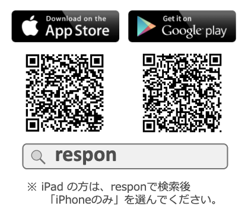
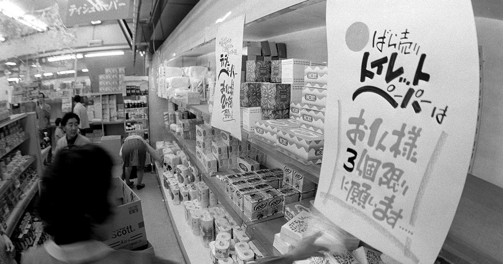

## 今日の目次

1. はじめに
1. 授業概要
1. 諸注意と評価
1. 国際政治経済学とは何か
1. アイスブレイク
1. まとめ

# はじめに

## 本日の目的と到達目標
#### 目的
本科目の目的・計画・評価方法・諸注意を紹介し、受講の可否の判断材料を提供する。仲間と受講の動機を共有し、今後学んでいくための環境を整える。国際政治経済学とはどのような学問分野なのか理解する。

#### 到達目標
1. 本科目「国際政治経済学I」の目的、進め方、評価方法を他人に説明できる。
1. 国際政治経済学とはどのような学問かを説明できる。
1. 自分の興味関心を言語化し、本科目で学びたいことを他人に説明できる。
1. 学ぶ仲間の名前を3人以上言うことができる。

## 担当者の自己紹介
::: {.columns}
::: {.column width=25%}

 - [[email]{.button}](mailto:jsuzuki@komazawa-u.ac.jp)
 - [[webpage]{.button}](https://junpei-suzuki.github.io)
 - [[researchmap]{.button}](https://researchmap.jp/junpeisuzuki-ps)
:::

::: {.column width=5%}
:::

::: {.column width=70%}
**鈴木淳平**（すずき・じゅんぺい）

駒澤大学法学部政治学科講師

 - 学位：早稲田大学博士（政治学）（2024年）
 - 職歴：早稲田大学助手→東京大学特任研究員→駒澤大学講師
 - 専門：先進諸国の比較政治経済学
:::

:::

## Respon
::: {.columns}
::: {.column width=65%}
授業中Responを使うことがありますので、設定をお願いします。

1. 右のQRコードでアプリをダウンロード
1. 起動したら「設定」でメールアドレスを入力し、「送信」
1. メールに記載の登録番号（6桁）を入力
1. 「サーバーを設定する」で[https://univ-gakushuin.respon.jp](https://univ-gakushuin.respon.jp)と入力
1. G-Portと同じIDとパスワードでログイン

:::

::: {.column width=5%}

:::

::: {.column width=30%}

:::

:::

## アンケート①

今日の調子はいかがですか？

1. 良い
1. まあまあ
1. 悪い

## アンケート②

今、何年生ですか？

1. 1年生
1. 2年生
1. 3年生
1. 4年生

## アンケート③

教室の中を見渡してみましょう。何人名前を知っている人がいますか？

1. 0人
1. 1人
1. 2人
1. 3人以上

# 授業概要
## 授業概要
- **越境する経済活動**と**政治**の関わりについて、国際関係論の視点から考察できる能力を身につける
- **国際政治経済学**（IPE）の研究成果から関連する**概念・理論・モデル**を学ぶ
- 第一学期では、**貿易**と**金融**をめぐる政治を扱う
- 講義方式によるが、**アクティブラーニング**を用いたワークを積極的に活用

## 到達目標
1. **学問領域としての国際政治経済学**を説明できる。
2. 国際政治経済学のパラダイムとしての**リアリズム、リベラリズム、批判理論**をそれぞれ説明できる。
3. 19世紀から世界大戦を経て戦後に至るまでの**国際政治経済秩序の歴史的展開**を描写できる。
4. **貿易が与える経済的な影響**を挙げた上で、**貿易をめぐって繰り広げられる政治的な対立と協調**を議論できる。
5. **国際金融が与える経済的な影響**を挙げた上で、**国際金融をめぐって繰り広げられる政治的な対立と協調**を議論できる。
6. グループワークを通じて、**相互に学びの深化に貢献**できる。

## 進行計画
{width=100%}

# 諸注意と評価
## 授業の進め方
- 基本的は対面の講義方式で、スライドを使用
- 授業資料等はMoodleで共有
    - スライドのハードコピーは配布はしない予定なので、各自でダウンロードすること
- 随時アクティブラーニングも取り入れ、「聞くだけ」の授業にはしない
    - 事後学習、問いかけ、アンケート、ディスカッション⋯
 - **事後学習**⋯授業の3日後（木曜日）を締切として、オン
ラインのフォーム上でリアクションペーパー記入（合計200字程度）
   - 次回授業でなるべくフィードバック予定

## 連絡方法とオフィスアワー

- コンタクトは必ず担当者のメールアドレスに行うこと
    - Moodleのメッセージ機能では気づかない可能性大
- メールを送付する際は「[メールの書き方](http://www2.ipcku.kansai-u.ac.jp/~iwamoto/email.pdf)」を必ず参照し、形式やマナーを守ること
- 非常勤講師のためオフィスアワーはなし
    - 授業の前後、メール、あるいはアポによりオンラインで
対応可能

## その他注意

 - オンラインのツールを用いることがあるので、できるだけ電子機器持参
 - 授業計画は若干の変更の可能性あり
 - 同じ担当者による「国際政治経済 II」の履修も合わせて
推奨
    - 第一学期の内容を前提に、グローバル化、安全保障、開発戦略を各論的に学習

## 評価

**試験**（70%）⋯期間内試験として実施

 - 選択式問題＋記述式問題
 - 各回授業の目標到達度を測定

**平常点**（30%）⋯事後学習のリアクションペーパー

 - 授業で学んだことと感想（20%）
 - 相互推薦による参加度合いの評価（10%）

## 相互推薦システム

 - アクティブラーニングへの積極的な参加を評価
     - その回の授業でのワーク等で良い働きをしたと思われる他の受講生を推薦
 - 推薦は任意で、推薦する場合は理由を記載
     - 理由が具体的かつ明確でない場合は推薦不成立
 - 対象授業期間[^target]を通じて推薦された回数をカウントし、次のように加点
     - 対象期間中6回以上推薦獲得→基礎点として平常点4ポイント分獲得
     - それ以降は1回の推薦につき平常点1ポイントを追加
     - 全12回推薦された場合は平常点の満点10ポイント

[^target]: 初回と試験回を除く全12回

# 国際政治経済学とは何か

::: {.notes}
冒頭に問いかけ「国際政治経済学とはどのような学問だと思いますか？」→2〜3人当てる

・国際的な政治経済？→「具体的にはどんなトピック？」

・貿易や金融の政治？→「その通りです」
:::

## 政治学としての IPE
国際政治経済学は政治学の分野の一つ

政治学の下位分野：

1. **アメリカ政治**（American Politics）
1. **比較政治**（Comparative Politics）
1. **公共政策**（Public Policies）
1. **政治理論**（Political Theory）
1. **国際関係論**（International Relations）

## 国際関係論としての IPE
国際政治経済学は国際関係論の分野の一つ

 - 国家間の政治を対象

国際関係論の下位分野：

1. **安全保障論**（Security Studies）
1. **国際政治経済学**（International Political Economy: IPE)

## よくある定義とその問題

> 国際関係論をさらに分けて、主に国際紛争、国家の軍事・防衛問題を扱う「安全保障論（Security Studies）」に対し、それ以外の諸問題を扱う部分を国際政治経済論と一括りにするのである。[^kohno2003]

環境や人権も対象になる現状を考慮しているが、60年代の古い国際関係論の見方が残存

 - **2トラック論**…安全保障と経済の断絶
 - **ハイポリティクス**としての安全保障と**ローポリティクス**としての経済

[^kohno2003]: 河野勝・竹中治堅編（2003）『アクセス国際政治経済論』日本経済評論社．p.3．

## IPEの登場
::: {.columns}

::: {.column width=50%}
1973年　**オイルショック**

- イスラエルとアラブ諸国間の戦争
- 西側への石油禁輸→価格高騰

→学問分野としての国際政治経済学の成立
:::

::: {.column width=5%}

:::

::: {.column width=45%}

:::

:::

::: {.notes}
オイルショック→経済の武器化→経済と政治の繋がりが意識される
:::

#### 本授業での IPE の定義
国境を超えて行われる経済活動と政治の相互作用を学ぶ学問分野

# アイスブレイク
## はじめに
#### 目的
 - 共に学ぶ仲間のことを知る
 - それぞれの受講動機を明確にする
 - グループワークに慣れる

#### 到達目標
 1. 2名以上の受講者の名前を言える
 1. 自分の受講動機を明確に他者に説明できる
 1. このクラスを安心な場となるような振る舞いができる

## グラウンドルール

学び合う環境づくりのために…

 - 「さん」づけで呼びましょう
 - どんなことからでも学べるつもりで
 - 相手の話を関心をもってよく聴く
 - **3K**⋯敬意を持って、忌憚なく、建設的に

## アイスブレイクの手順
::: {style="font-size: 0.9em;"}
 1. 受講動機を整理する（個人：1分）
    - どこかにメモをする
 1. お互いを知る①（ペア：1:30×2人）
    - 2人組になる
    - あいうえお順で早い方から自己紹介
    - 相手の名前・出身高校・所属部活／サークル・受講動機を聴き、メモする
 1. お互いを知る②（グループ：1:30×4人）
    - ペア2組を合併して、4人グループを作る
    - ペアの相手の名前・出身高校・所属部活／サークル・受講動機を、新たなグループメンバーに紹介する
    - 順番は、あいうえお順で遅い方のいるペアから、遅い方が先に紹介
    
:::

# まとめ
## 本日の目的と到達目標
#### 目的
本科目の目的・計画・評価方法・諸注意を紹介し、受講の可否の判断材料を提供する。仲間と受講の動機を共有し、今後学んでいくための環境を整える。国際政治経済学とはどのような学問分野なのか理解する。

#### 到達目標
1. 本科目「国際政治経済学I」の目的、進め方、評価方法を他人に説明できる。
1. 国際政治経済学とはどのような学問かを説明できる。
1. 自分の興味関心を言語化し、本科目で学びたいことを他人に説明できる。
1. 学ぶ仲間の名前を3人以上言うことができる。

## 次回までに

#### 事後学習

 - 授業資料を見直し、目標到達をセルフチェック
 - Moodle上でのリアクションペーパー入力（木曜日まで）
    - 今回は練習なので成績評価には含めません。