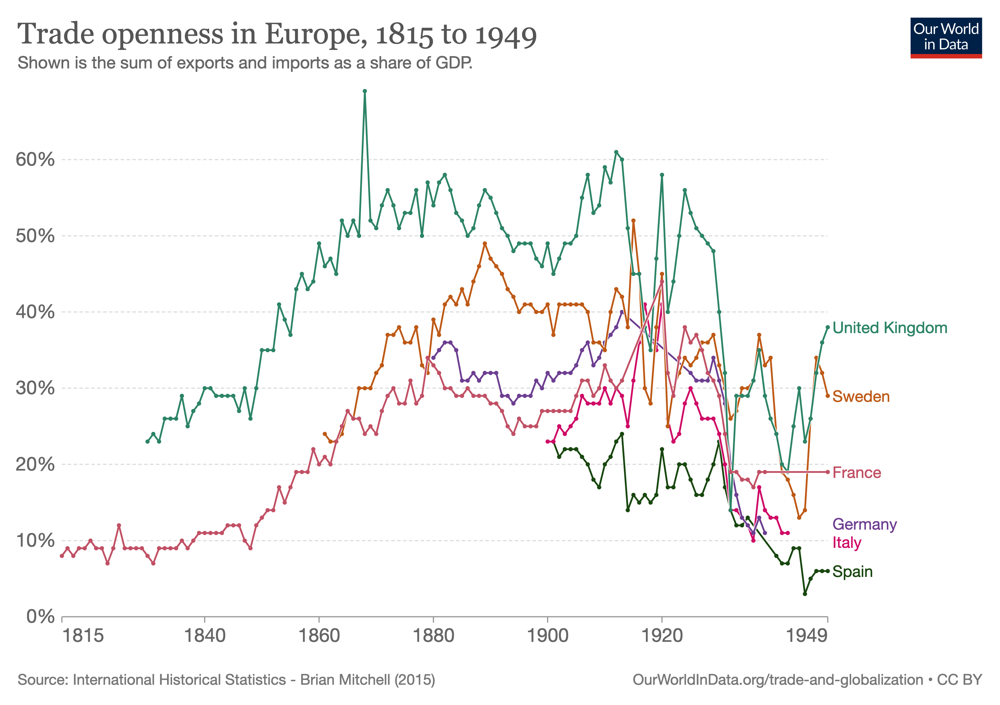
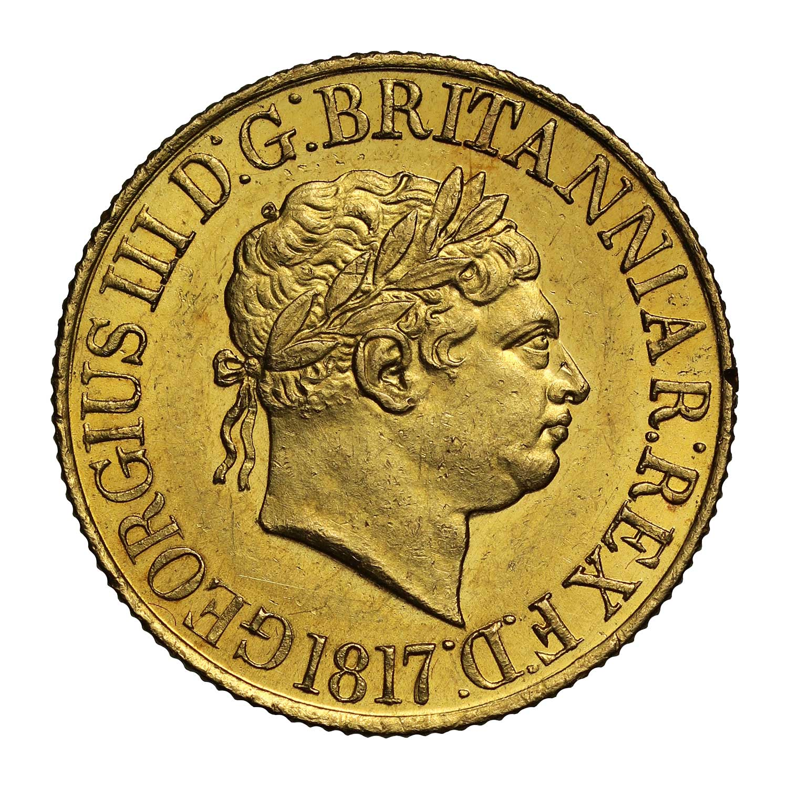
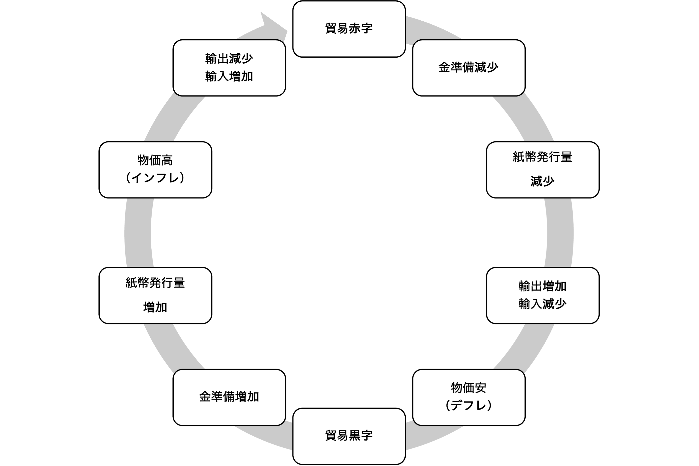

## 今日の目次

1. はじめに
1. 重商主義
1. パックス・ブリタニカ
1. 金本位制
1. 世界大戦と世界恐慌
1. まとめ

# はじめに
## アンケート
ゴールデンウィークを楽しみましたか

1. はい
1. いいえ

前回の復習をしてきましたか？

1. はい
1. いいえ

## 先週のRPより
TBD

## 本日の目的と到達目標
#### 目的
古典的なリアリズムの一つである重商主義を学んだ上で、世界で初めての経済協調体制であるパックス・ブリタニカの勃興と崩壊の過程を歴史的に概観する。

#### 到達目標
1. 重商主義とはどのような考え方か説明できる。
1. 古典派経済学と覇権安定理論に着目しつつ、パックス・ブリタニカとはどのような体制かを説明できる。
1. 金本位制下における貿易収支の調整メカニズムを説明できる。
1. 二度にわたる世界大戦と世界恐慌がパックス・ブリタニカに与えた影響を説明できる。

## 本日の授業の位置付け

# 重商主義
## 質問
「日本は貿易黒字を出すために行動すべきである」という意見に賛成ですか、それとも反対ですか？

## 重商主義 (Mercantilism)
**貿易黒字**を最大化するために国家主導による国内産業育成と輸入の規制を求める経済政策上の考え

- **主権国家体制**が確立した16〜18世紀の欧州で支配的
- 具体的な政策：
   - 植民地獲得…資源、市場、および貿易拠点の確保
   - 貿易に対する法的規制
      - イギリスの航海法・穀物法、フランスの大陸封鎖令…
   - 独占会社の設立
      - イギリス東インド会社、フランスのマニュファクチュア…

Q. もしすべての国が貿易黒字を出そうとしたらどうなる？

## 重商主義の特徴と帰結
**古典的リアリズム**としての重商主義

- 有限の富をめぐる国家間のゼロサム的対立関係
- 「富の蓄積⇄軍事力を含めた国力」という相互補完的関係

重商主義の帰結→通商・航海をめぐる戦争の多発[^holsti1991]

::: {style="font-size: 0.7em;"}
::: {.columns}
::: {.column width=50%}
| **1648-1713の戦争原因**|     | 
| -------------------- | --- | 
| 領土                 | 55  | 
| 通商・航海           | 36  | 
| 王位継承             | 31  | 
| 戦略的領土           | 23  | 
| 国家および体制の生存 | 23  | 
| 宗教的保護権         | 14  | 
| 条約の強制           | 14  | 

:::

::: {.column width=50%}
| **1945-89の戦争原因**  |     | 
| ---------------------- | --- | 
| 民族独立・国家建設     | 28  | 
| 国家および帝国領の防衛 | 28  | 
| 政府の構成             | 28  | 
| 領土                   | 24  | 
| 戦略的領土             | 21  | 
| 国家および体制の生存   | 21  | 
| 民族統一。その確率     | 17  | 

:::

:::

:::

[^holsti1991]: Holtsi, K. (1991). *Peace and War: Armed Conflicts and International Order 1648-1989*. Cambridge University Press.

# パックス・ブリタニカ
::: {.notes}
第二回で扱った『覇権安定理論』とはどのような考え方でしたか？」→1分黙考からの指名or挙手での発言
:::

## パックス・ブリタニカ (pax britannica)
イギリスの覇権の下で国際関係が安定していた19世紀から第一次世界大戦までの時代

#### 覇権安定理論
他国を圧倒する国力を持った国（＝**覇権国** hegemon）が存在すると国際関係が安定し秩序が形成されやすいとする考え方

- **国際公共財**…公共財の一種で、その便益が国境を超えて広がるもの
   - 圧倒的な**海軍力**による安全保障
   - **自由貿易主義**の執行
   - **金本位制**（後述）

## 欧州の貿易 (1815-1949)

## 自由貿易主義の確立
18〜19世紀　**産業革命**

- 工業生産の拡大と経済成長
- 商工業資本家と工場労働者の台頭

1836年　**反穀物法同盟**…コブデンとブライトの主導

- 安価な原材料を求める資本家と生計費削減を求める労働者の支持
- 理論的支柱としての**古典派経済学**

1846年　**穀物法**の廃止

1849年　**航海法**の廃止

1860年　**コブデン＝シュヴァリエ条約**

- 英仏両国で相互に関税廃止に合意

## 古典派経済学 (classical economics)
18世紀後半から19世紀前半にかけてイギリスに登場した経済学の考え方

::: {.columns}
::: {.column width=70%}

- 重商主義批判→「**見えざる手**」による自由放任主義
- スミスの絶対優位モデルとリカードの比較優位モデル→貿易の**ポジティブサム性**

→国際協調の可能性を示唆する**古典的リベラリズム**
:::

::: {.column width=5%}

:::

::: {.column width=25%}

:::

:::

# 金本位制
## 金本位制 (gold standard)
一定の比率のもとで政府が自国通貨（＝**兌換紙幣**）と金の交換を保証する制度

::: {.columns}
::: {.column width=20%}

:::

::: {.column width=5%}

:::

::: {.column width=65%}

:::

:::

## 貿易収支と金準備：ロールプレイ
今、日本に住んでいるあなたはアメリカの企業から牛肉を1トン輸入したところです。1トンの代金として200万円を相手方に支払わなければなりません。また、以下のような条件があります。

- 日本とアメリカは円とドルという別の通貨を使用
- ただし為替市場は存在せず、自由な交換は不可
- 日米ともに金本位制を採用

1. 日本円で米国企業への支払いはできるでしょうか？
1. 米ドルを手に入れるためにはどうすればいいでしょうか？
1. 支払いが完了した場合、実質的に金はどのように動いているでしょうか？

::: {.notes}
1. できない
1. 手持ちの日本円を日本政府で金と交換→金を米国政府でドルと交換
1. 金は日本からアメリカに移動

金が実質的に通貨→輸入は金の流出、輸出は金の流入
:::

## 金準備と物価：クイズ
1. 金本位制を採っている日本政府が金準備と比較して多くの兌換紙幣を発行したとします。どのような問題が起こると思いますか。
1. 一般に紙幣の発行量が増えると物価はどのようになるでしょうか。
1. 日本の全体的な物価水準が一気に10％減少したとします。この時、国際市場で日本製品の売れ行きはどのようになるでしょうか。

::: {.notes}
1. 交換要求が大量に来た場合に応じられず、金本位制が崩壊する→金本位制を維持するためには紙幣の発行量は金本位制と連動させる必要
1. 物価は高くなる＝インフレになる
1. 日本製品が安くなるので、売れ行きはよくなる→貿易黒字圧力
:::

# 世界大戦と世界恐慌
## 第一次世界大戦 (1914〜18)
::: {.columns}
::: {.column width=60%}
- 協商国（英仏露）vs. 中央同盟国（独墺土）
- 日米は協商側で参戦

**貿易制限**と**金本位制の停止**により、直接的に自由貿易体制に打撃

**イギリスの覇権の失墜**により、自由貿易体制の構造的前提が崩壊
:::

::: {.column width=5%}

:::

::: {.column width=35%}

:::

:::

## 戦間期の協調
**ヴェルサイユ条約** (1919年)

- ドイツの過大な賠償責任
- ルール地域占領、消極的抵抗、ハイパーインフレ…

**ドーズ案** (1924年) と**ヤング案** (29年)

- アメリカの周旋による賠償責任軽減と欧州復興支援

→国際関係の安定化と貿易の回復

- ロカルノ条約、パリ不戦条約、海軍軍縮条約…

## 世界大戦と世界恐慌
::: {style="font-size: 0.9em;"}
1929年　**世界恐慌** (the Great Depression)

- 10月24日の「**暗黒の木曜日**」が世界に波及
   - NY株式市場の大暴落
   - 日本では**昭和恐慌**

金本位制による政策への制約

   - 経済不安による金交換→金準備減少
   - 金本位制のままでは紙幣増刷ができない

**ブロック経済**…列強諸国の閉鎖経済化

   - ホーレー＝スムート関税法（米、1930年）、オタワ会議（英、32年）
   - 金本位制の放棄＋高率の関税→貿易の急激な縮小
   
→対立がエスカレートして**第二次世界大戦**へ
:::

## Think-pair-share (10分)
戦間期の国際協調が5年で崩壊した理由は、覇権安定理論に基づくとどのように説明できるでしょうか。

1. **Think**（1分）…一人で考える
1. **Pair**（4分）…ペアで話し合う
1. **Share**（3分）…全体に共有する

# まとめ
## 本日の目的と到達目標
#### 目的
古典的なリアリズムの一つである重商主義を学んだ上で、世界で初めての経済協調体制であるパックス・ブリタニカの勃興と崩壊の過程を歴史的に概観する。

#### 到達目標
1. 重商主義とはどのような考え方か説明できる。
1. 古典派経済学と覇権安定理論に着目しつつ、パックス・ブリタニカとはどのような体制かを説明できる。
1. 金本位制下における貿易収支の調整メカニズムを説明できる。
1. 二度にわたる世界大戦と世界恐慌がパックス・ブリタニカに与えた影響を説明できる。

## 次回までに

#### 事後学習

 - 授業資料を見直し、目標到達をセルフチェック
 - Moodle上でのリアクションペーパー入力（木曜日まで）