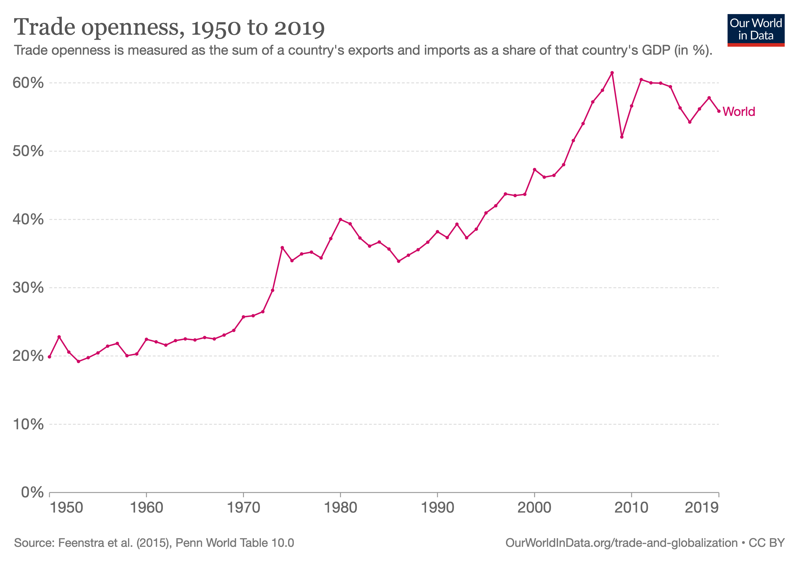
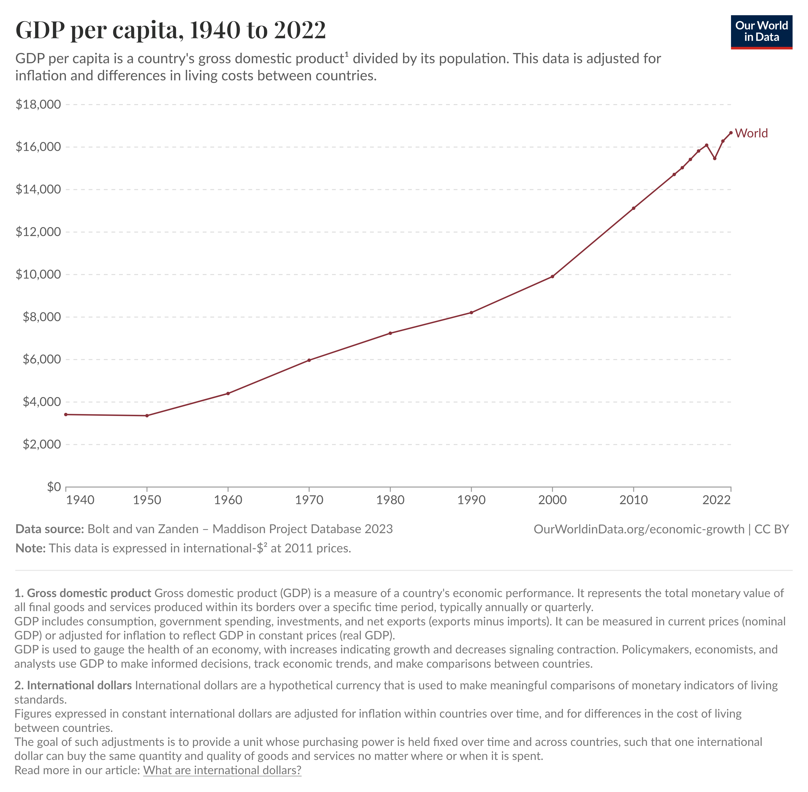
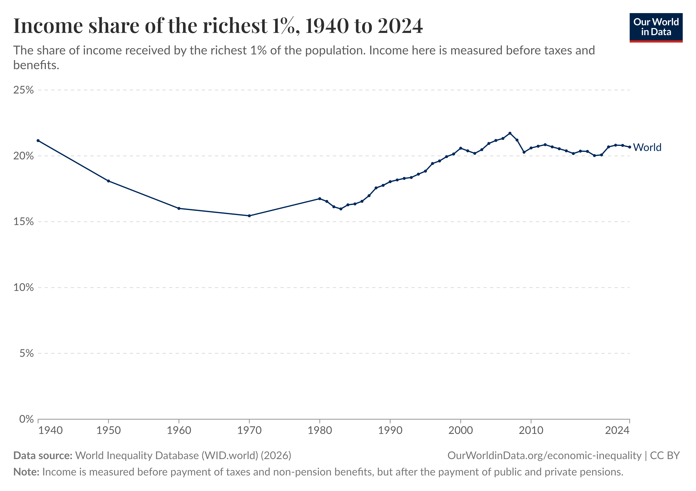
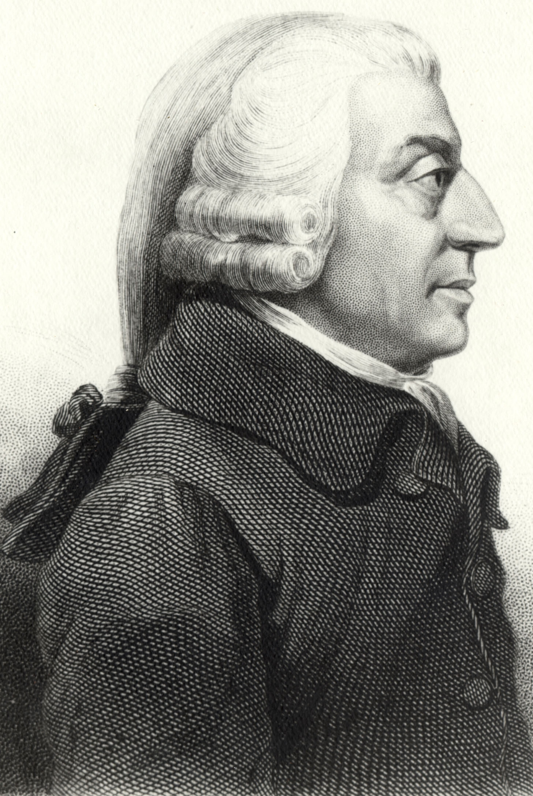
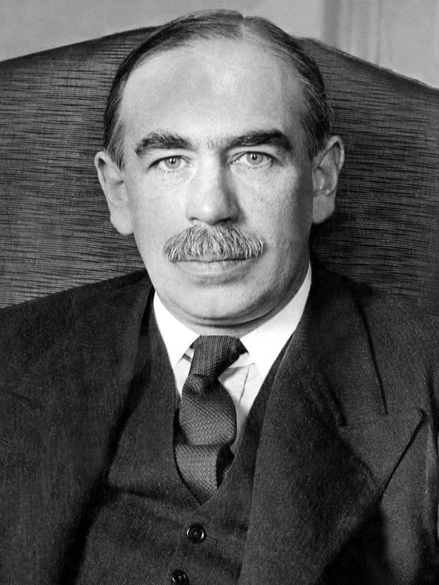
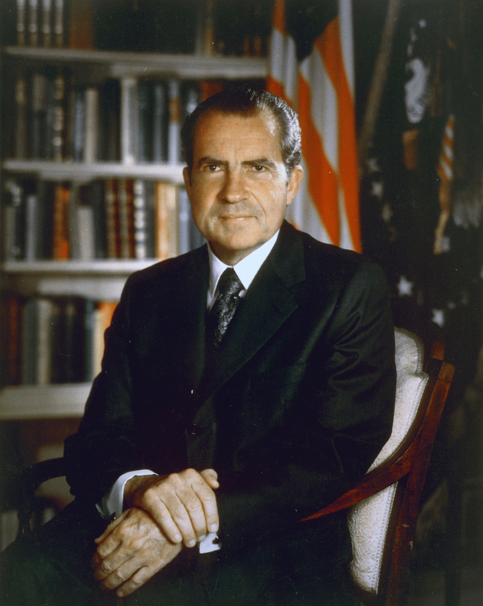

## 今日の目次

1. はじめに
1. 戦後国際体制の概要
1. 埋め込まれた自由主義
1. ケインズ主義経済学
1. 戦後体制の再編
1. まとめ

# はじめに
## 先週のRPより
TBD

## 本日の目的と到達目標
#### 目的
戦後に成立した国際政治経済に関する協調体制はどのようなものであるのか、その基本的な特徴を理解するとともに、より現代の展開を考察する。

::: {.fragment .fade-in}
#### 到達目標
1. パックス・ブリタニカと対比しながら、戦後の国際政治経済体制を説明できる。
1. 「埋め込まれた自由主義」という概念を説明できる。
1. 戦後福祉国家を理論的に正当化したケインズ経済学について、古典派経済学と対比しつつ説明できる。
1. 1970年代に戦後体制が直面した国際・国内的な再編圧力を挙げ、説明できる。

:::

## 本日の授業の位置付け

# 戦後国際体制の概要
## 復習 (3分)
先週学んだ19世紀のパックス・ブリタニカとはどのような体制であったでしょうか。
①覇権国家、②国家と経済の関わり、③為替制度それぞれについてペアで考えてみてください。

## PBと戦後体制
::: {.columns}
::: {.column width=50%}
::: {.fragment .fade-in}
**自由主義体制**

::: {.incremental}
- イギリスの覇権
   - **パックス・ブリタニカ**
- 自由放任国家
   - 古典派経済学
- 金本位制

:::
:::
:::

::: {.column width=50%}
::: {.fragment .fade-in}
**戦後国際政治経済体制**

::: {.incremental}
- アメリカの覇権
   - **パックス・アメリカーナ**
- 福祉国家
   - **ケインズ主義経済学**
- 固定相場制
   - ブレトン・ウッズ体制

:::
:::
:::

:::

## 貿易の拡大

## 経済成長

## 経済成長

# 埋め込まれた自由主義
## 埋め込まれた自由主義
#### (embedded liberalism)[^ruggie1982]
::: {.fragment .fade-in}
戦後体制の特徴＝**自由貿易**と**国家の自律性**のバランス

::: {.incremental}
- 自由貿易による悪影響を国家が緩和

:::
:::

::: {.fragment .fade-in}
**大西洋憲章**（1941）…米英の戦後構想

::: {.incremental}
- 世界の通商および原料の均等な開放 (第4条)
- 労働条件の改善、経済的進歩および社会保障 (第5条)

:::
:::

::: {.fragment .fade-in}
具体的には…

::: {.incremental}
 - 国際的には**セーフガード**、**資本移動規制**
 - 国内的には**ケインズ主義福祉国家**

:::
:::

[^ruggie1982]: Ruggie, J. G. (1982). International regimes, transactions, and change: embedded liberalism in the postwar economic order. *International Organization, 36*(2), 379-415.

::: {.notes}
完全に自由貿易ではなく、かといって国家が完全に統制するのでもない

:::

## 質問
日本をはじめ世界は資本主義経済に組み込まれており、多くの財が市場で取引されています。

しかし、よくよく考えれば市場取引に馴染まない財というものがあります。

それはなんだと思いますか。

## ポランニー『大転換』
::: {.fragment .fade-in}
前近代、経済は社会全体に「**埋め込まれて**」いた

::: {.incremental}
- 部族社会の規範、封建領主の介入、ギルドの規制…

:::
:::

::: {.fragment .fade-in}
近代、「**自己調整的市場**」の登場

::: {.incremental}
- 市場が社会から独立し、さらに社会全体を従属させる

:::
:::

::: {.fragment .fade-in}
**擬制商品論** (fictitious commodities)

::: {.incremental}
- 本来商品ではない**労働・土地・貨幣**が商品化され市場で取引

:::
:::

::: {.fragment .fade-in}
自己調整型市場の帰結

::: {.incremental}
- ファシズム、共産主義などの全体主義→第二次世界大戦

:::
:::

::: {.fragment .fade-in}
→ラギー「経済を社会に再び埋め込む」＝埋め込まれた自由主義

:::

::: {.notes}
擬制商品論の例＝労働

労働力とは生きた人間→「在庫」として余ることは生活ができないこと
:::

## フォーディズム (Fordism)
::: {.columns}
::: {.column width=70%}
大量生産と大量消費が好循環していく経済システム

::: {.incremental}
- フォード社創業者の**ヘンリー・フォード**の戦略
   - **ライン式生産様式**と**高賃金**
- 大量生産による生産性向上→労働者の賃金上昇→大量消費…
   - 福祉国家が労働者の購買力を補完

:::
:::

::: {.column width=5%}
:::

::: {.column width=25%}

:::

:::

# ケインズ主義経済学
## 古典派経済学 (classical economics)
::: {.columns}
::: {.column width=70%}
::: {.fragment .fade-in}
18世紀後半から19世紀前半にかけてイギリスに登場した経済学の考え方

- アダム・スミス、トマス・ロバート・マルサス、デイヴィッド・リカード
:::

::: {.fragment .fade-in}
「**見えざる手**」による自由放任主義
:::

::: {.fragment .fade-in}
世界恐慌の分析

::: {.incremental}
- 高失業←高い賃金が企業の労働需要を減退
- 賃金が下がるまで待てば良い

:::

:::

::: {.fragment .fade-in}
Q. この分析の問題は？
:::

:::

::: {.column width=5%}

:::

::: {.column width=25%}

:::

:::

::: {.notes}
世界恐慌の時のアメリカの失業率は23%
:::

## ケインズ主義経済学 
#### Keynesian economics
::: {style="font-size: 0.9em;"}
::: {.columns}
::: {.column width=70%}
**ジョン・メイナード・ケインズ**に始まる経済学

::: {.fragment .fade-in}
古典派批判「価格は伸縮的でない」

::: {.incremental}
- 賃金の**下方硬直性**…一回上がったら下がりにくい

:::

:::

::: {.fragment .fade-in}
**有効需要** (effective demands)…貨幣の裏付けのある需要

::: {.incremental}
- **非自発的失業**…労働需要の不足による失業
:::

:::

::: {.fragment .fade-in}
政府の積極的役割が推奨（**マクロ経済政策**）

::: {.incremental}
- 金融緩和と財政出動
- ニューディール、ベヴァレッジ報告→福祉国家

:::
:::

:::

::: {.column width=5%}

:::

::: {.column width=25%}

:::
:::
:::

# 戦後体制の再編
## 戦後体制の変化
::: {.fragment .fade-in}
**国際的な変化**…アメリカの（相対的）衰退

::: {.incremental}
 - アメリカの他国に対する優位が失われる
 - 「覇権による安定」の前提が崩壊

:::
:::

::: {.fragment .fade-in}
**国内的な変化**…ケインズ主義への疑念

::: {.incremental}
 - ケインズ主義では説明できない現象
 - 新しい経済学のパラダイムの登場

:::
:::

## 復習クイズ
ある国が金本位制をとっているとします。この国が貿易赤字を出した場合、その金準備はどうなりますか。

1. 増える
1. 変わらない
1. 減る

## アメリカの衰退
::: {.colmuns}
::: {.column width=70%}
::: {.fragment .fade-in}
1960年代〜　**経常赤字**→ドル信用低下

::: {.incremental}
- ベトナム戦争の長期化
- 旧敗戦国の経済復興
- 国内福祉の拡大

:::
:::

::: {.fragment .fade-in}
1971年8月15日　**ニクソン・ショック**

::: {.incremental}
- 金ドルの交換一時停止の宣言
- 以降なし崩し的に**変動相場制**へ

:::
:::

:::

::: {.column width=2%}

:::

::: {.column width=28%}
::: {.fragment .fade-in}
{width=100%}
:::
:::

:::

## ケインズ主義への疑念
::: {.fragment .fade-in}
**スタグフレーション** (stagflation)

::: {.incremental}
- stagnation (停滞) + inflation (インフレ)
:::
:::

::: {.fragment .fade-in}
**オイルショック**（1973）による物価高騰

::: {.incremental}
- 需要ではなく供給側の問題
:::
:::

::: {.fragment .fade-in}
産業構造の転換

::: {.incremental}
- **サービス産業化**…製造業よりも生産性が低い
- **大量生産大量消費**から**少量多品種生産**へ
:::
:::

::: {.fragment .fade-in}
→ケインズ主義の前提が崩壊
:::

::: {.fragment .fade-in}
Q. この状況で政府は経済とどのようにかかわるべき？
:::

## 新たな経済学と新自由主義
::: {.fragment .fade-in}
#### サプライサイド経済学 (supply-side economics)
減税や規制緩和などを通じて経済成長を喚起しようとする考え方
:::

::: {.fragment .fade-in}
#### 新自由主義 (neoliberalism)
市場原理主義に回帰し政府の役割を最小限にする動き

::: {.incremental}
- 政府の歳出削減、公営部門の民営化、金融取引の規制緩和
- サッチャリズム、レーガノミクス、中曽根行革…

:::
:::

::: {.fragment .fade-in}
→国家と経済の関わりの見直し
:::

# まとめ
## 本日の目的と到達目標
#### 目的
戦後に成立した国際政治経済に関する協調体制はどのようなものであるのか、その基本的な特徴を理解するとともに、より現代の展開を考察する。

::: {.fragment .fade-in}
#### 到達目標
1. パックス・ブリタニカと対比しながら、戦後の国際政治経済体制を説明できる。
1. 「埋め込まれた自由主義」という概念を説明できる。
1. 戦後福祉国家を理論的に正当化したケインズ経済学について、古典派経済学と対比しつつ説明できる。
1. 1970年代に戦後体制が直面した国際・国内的な再編圧力を挙げ、説明できる。

:::

## 次回までに

#### 事後学習

 - 授業資料を見直し、目標到達をセルフチェック
 - Moodle上でのリアクションペーパー入力（木曜日まで）
