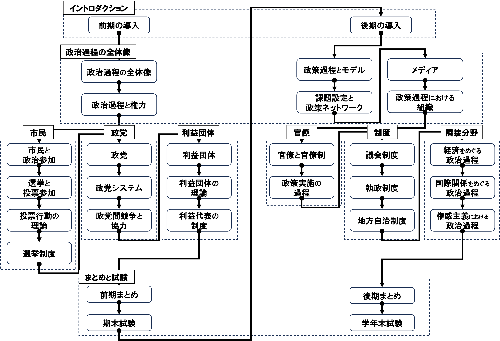
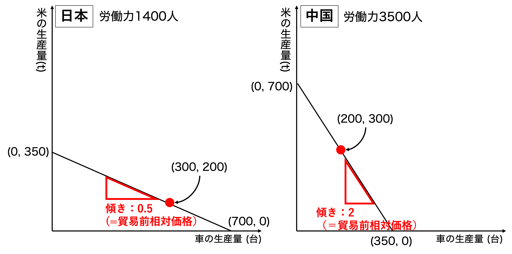
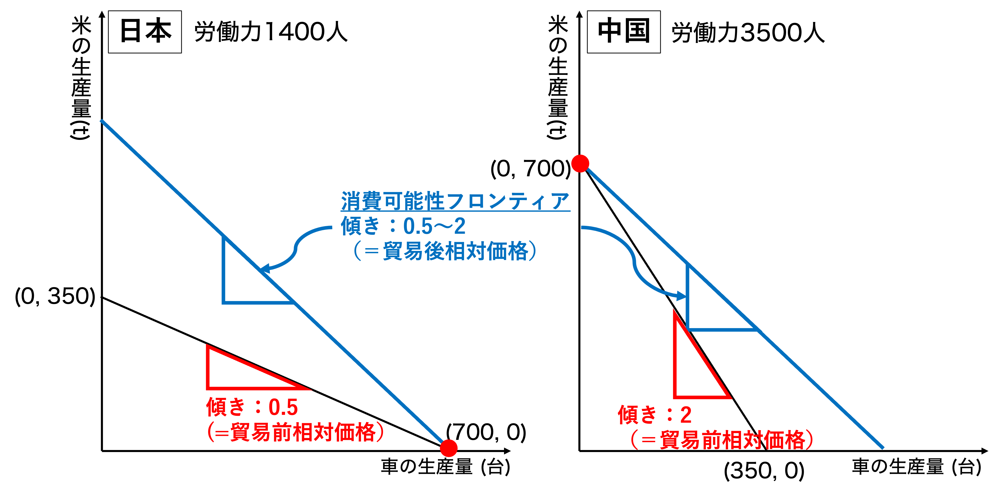
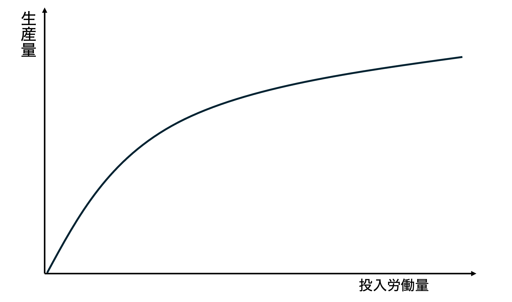
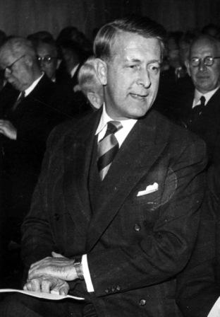
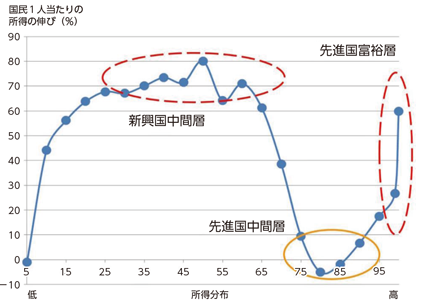

## 今日の目次

1. はじめに
1. 貿易の経済学
1. 比較優位モデル
1. 特殊要素モデル
1. ヘクシャー＝オリーンモデル
1. まとめ

# はじめに
## 先週のRPより
TBD

## 本日の目的と到達目標
#### 目的
比較優位モデル、特殊要素モデル、ヘクシャー＝オリーンモデルという3つの経済学のモデルを学び、貿易が与える影響を理解する。

::: {.fragment .fade-in}
#### 到達目標
1. 比較優位モデルに基づいて、貿易が経済に与える影響を議論できる。
1. 特殊要素モデルに基づいて、貿易が経済に与える影響を議論できる。
1. ヘクシャー＝オリーンモデルに基づいて、貿易が経済に与える影響を議論できる。

:::

## 本日の授業の位置付け

# 貿易の経済学
## 貿易の経済学
::: {.incremental}
- 貿易が与える経済的影響を明らかにするモデル
   - 財の生産および所得分配

:::

::: {.fragment .fade-in}
::: {.columns}
::: {style="font-size: 0.75em;"}
::: {.column width=33%}
**比較優位モデル**

- **比較優位**を持つ財に特化→総生産量の増加
- 貿易は全体的に利益

:::

::: {.column width=33%}
**特殊要素モデル**

- 貿易は全体的に利益
- **特殊要素**を持つ人々の間で格差
   - 優位部門に得、劣位部門に損

:::

::: {.column width=33%}
**ヘクシャー＝オリーンモデル**

- 貿易は全体的に利益
- **生産要素賦存**の違いによる格差
   - 豊富要素に得、希少要素に損

:::

:::

:::

:::

# 比較優位モデル
## 比較優位モデル
::: {.columns}

::: {.column width=70%}
**デイヴィッド・リカード**（1817）『経済学および課税の原理」

- 別名「リカードモデル」

::: {.fragment .fade-in}
主張「自由貿易は全ての国にとって利益をもたらす」

::: {.incremental}
- 貿易の開始→**比較優位**財の価格上昇
- 価格上昇→その財の生産に**特化**
- 生産特化→財の**総生産量増加**

:::
:::
:::

::: {.column width=30%}

:::

:::

## 絶対優位と比較優位
::: {.fragment .fade-in}
#### 絶対優位 (absolute advantage)
ある財を**相手よりも**効率的に生産できること
:::

::: {.fragment .fade-in}
#### 比較優位 (comparative advantage)
ある財を**別の財よりも**効率的に生産できること
:::

::: {.fragment .fade-in}
効率的＝より少ない資源で多くの生産ができる
:::

::: {.fragment .fade-in}
例：日本と中国が**労働力**で**車**と**米**を生産

- この時労働力は**生産要素** (factor)という

|          | 車1台 | 米1t | 
| -------- | ----- | ---- | 
| **日本** | 2人   | 4人  | 
| **中国** | 10人  | 5人  | 

:::

::: {.notes}
日本は車と米について、中国に対して絶対優位

- 中国は両方において日本よりも非効率

しかし、中国は米に比較優位

- 自分の中の強みは車ではなく米

絶対優位がなくても、比較優位があれば良い

:::

::: {.fragment .fade-in}
Q：車／米の生産が効率的なのは日中どちらですか？
:::

## 相対価格と貿易
**相対価格**…ある財と別の財の価格の比

::: {.incremental}
- **機会費用**…その財の生産増加のためにどれくらい他の財の生産を減らすべきか
   - 日本：車1台=米0.5t、中国：車1台=米2t

:::

::: {.fragment .fade-in}
貿易を開始すると…

::: {.incremental}
- 中国車よりも日本車の方が安い
- 日本車の購入増→日本車の価格上昇
- 米では上記と逆が発生
   - 中国米の価格上昇
- →相対価格は車1台＝米0.5-2tあたり

:::

:::

::: {.fragment .fade-in}
**貿易は比較優位財の相対価格を上昇させる**
:::

## 質問
あなたは日本の労働者です。

貿易が開始された結果、車が米に対して高くなりました。

その気があればどちらでも働けるとして、自動車工場と米農家のどちらで働きたいですか？

## 相対価格と特化

::: {}
仮定：

::: {.incremental}
- 労働者の移動は完全自由
- 価格＝労働者の賃金

::: {.fragment .fade-in}
各国は相対価格が上昇した財（＝比較優位財）に**特化**

:::

:::

:::

::: {.columns}
::: {.fragment .fade-in}
::: {.column width=45%}

**日本**…**車**に特化

::: {.incremental}
1. 価格：車>米
1. 賃金：車産業>米農業
1. 労働：米から車へ

:::
:::

::: {.column width=5%}

:::

::: {.column width=45%}

**中国**…**米**に特化

::: {.incremental}
1. 価格：車<米
1. 賃金：車産業<米農業
1. 労働：車から米へ

:::
:::

:::

:::

## 生産可能性フロンティア
#### Production Possibility Frontier (PPF)
{width=80%}

::: {.fragment .fade-in}

1. 特化前の車と米それぞれの日中総生産量は？
1. 各国の特化後の点はPPF上のどこ？
1. 特化後の車と米それぞれの日中総生産量は？
:::

::: {.notes}
生産可能性フロンティア＝労働力1400人の日本と労働力3500人の中国が労働力を振り分けた結果、どのように車と米の生産が行われるかを図示

- 日本の(0, 350)＝労働力を全て米に振り向けた結果、車0台米350t
- 日本の(700, 0)＝労働力を全て車に振り向けた結果、車700台米0t

特化前、日本が(300, 200)、中国が(200, 300)を生産

比較優位財への特化

- 日本…車
- 中国…米

:::

## 消費可能性フロンティア
#### Consumption Possibility Frontier (CPF) 
{width=80%}

::: {.fragment .fade-in}
特化の結果、総生産量（＝消費可能性）が増えている！
:::

::: {.notes}
- 特化の結果、総生産量が増えている
   - 車：500→700台；米：500→700t
- CPFは700台の車、700tの米をどのように分け合って消費できるかを表す
   - 傾きは貿易後の相対価格に一致＝日中同一
   - PPFの上に行く→生産量の増加

:::

# 特殊要素モデル
## 特殊要素モデル
::: {.columns}

::: {.column width=70%}
**ジェイコブ・ヴァイナー**がリカードモデルを拡張

- 別名「リカード＝ヴァイナーモデル」

::: {.fragment .fade-in}
主張「貿易は全体的には得だが、**不平等な所得分配**を生み出す」

::: {.incremental}
- **生産要素**は労働だけではない
- 部門間を移動できない**特殊要素**の存在
- 相対価格の変化→生産要素所得の変化
- 貿易の開始→所得格差の発生
   - 比較優位部門と比較劣位部門

:::
:::
:::

::: {.column width=30%}

:::

:::

## 2財3要素モデル
::: {style="font-size: 0.9em;"}
ドイツが以下の状況にあるとする

::: {.incremental}
- 財：**布**と**農作物**
   - 比較優位は**布**
- 生産要素：**労働**、**資本**、**土地**

:::

::: {.fragment .fade-in}
|          | 布  | 農作物 |             | 
| -------- | :---: | :------: | ------------ | 
| **労働** | ◯  | ◯      | **一般要素** | 
| **資本** | ◯  | ×      | **特殊要素** | 
| **土地** | ×   | ◯     | **特殊要素** | 

:::

::: {.incremental}
- **一般要素**…部門間を**移動できる**生産要素
- **特殊要素**…部門間を**移動できない**生産要素

:::

:::

## 生産者の行動
::: {.fragment .fade-in}
生産者はそれぞれ布と農作物を生産

::: {.incremental}
- **利潤**＝売り上げ-費用→最大化
   - 売り上げ＝価格×生産量
   - 費用＝**賃金・利子・地代**

:::
:::

::: {.fragment .fade-in}
#### 収穫逓減 (diminishing returns)
{width=80%}

:::

::: {.notes}
生産した分は全て売れると仮定

労働の投入の増加による生産量の増加は徐々に減っていく
:::

## 貿易の開始
::: {}
貿易を開始すると…

::: {.incremental}
- 布の**相対価格上昇**
- 生産者は**布**の増産／**農作物**の減産
   - リカードモデルの特化と同じ
   - 特化による総生産増が実現

:::
:::

::: {.fragment .fade-in}
Q. **労働者の賃金**、**資本家の利子**、**地主の地代**はどうなる？

:::

## 貿易の開始（続）
::: {style="font-size: 0.8em;"}
::: {.fragment .fade-in}
**労働者**（一般要素）…影響不明

::: {.incremental}
- 布生産に移動
- 名目賃金の上昇
   - ただし収穫逓減→価格上昇ほどでない
- 実質賃金
   - 布で測ったら下落
   - 農作物で測ったら上昇

:::

:::

::: {.columns}
::: {.column width=50%}
::: {.fragment .fade-in}
**資本家**（特殊要素）…得をする

::: {.incremental}
- 移動しない
- 名目利子の上昇
- 実質利子の上昇
   - 布で測ったら賃金下落

:::
:::
:::

::: {.column width=50%}
::: {.fragment .fade-in}
**地主**（特殊要素）…損をする

::: {.incremental}
- 移動しない
- 名目地代の上昇
- 実質地代の上昇
   - 農作物で測ったら賃金下落

:::
:::
:::

:::
:::
   
# ヘクシャー＝オリーンモデル
## ヘクシャー＝オリーンモデル
::: {.columns}

::: {.column width=70%}
**エリ・ヘクシャー**と**ベルティル・オリーン**が考案

::: {.fragment .fade-in}
主張「貿易は全体的には得だが、**不平等な所得分配**を生み出す」

::: {.incremental}
- 全ての生産要素は**長期的には移動可能**
- 財の生産に使う生産要素の配合に違い
- 生産要素賦存→貿易パターン
- 貿易の開始→所得格差の発生
   - 豊富生産要素と希少生産要素

:::
:::
:::

::: {.column width=30%}

:::

:::

## 2-2-2モデル
::: {.fragment .fade-in}
国：**ドイツ**と**フランス**
:::

::: {.fragment .fade-in}
財：**布**と**食品**
:::

::: {.fragment .fade-in}
生産要素：**労働**、**資本**

:::

::: {.fragment .fade-in}
|            |                |            | 
| ---------- | -------------- | ---------- | 
| **布**     | **労働集約財** | 労働＞資本 | 
| **資本**   | **資本集約財** | 労働＜資本 | 

:::

::: {.fragment .fade-in}
**集約性**…相対的にどちらの生産要素を使うか

:::

::: {.fragment .fade-in}
**生産要素賦存** (factor endowment)…相対的にどちらの生産要素が豊富か

::: {.incremental}
- ドイツ…労働が豊富
- フランス…資本が豊富

:::
:::

::: {.fragment .fade-in}
Q: ドイツとフランスはそれぞれ布と食品どちらが得意？

:::

## 貿易の開始
貿易を開始すると…

::: {.incremental}
- ドイツ…布に比較優位→相対価格の増加→布の輸出
- フランス…食品に比較優位→相対価格の増加→食品の輸出
:::

::: {.fragment .fade-in}
リカードモデルの特化と同様→総生産量の増加
:::

::: {.fragment .fade-in}
#### ヘクシャー＝オリーン定理
各国は自国に**豊富**な生産要素を集約的に用いる財を**輸出**し、**希少**な生産要素を集約的に用いる財を**輸入**する

:::

## 特化の影響

::: {.incremental}
- ドイツ…布への特化→労働需要の増加→賃金上昇
- フランス…食品への特化→資本需要の増加→利子上昇

:::

::: {.fragment .fade-in}
#### ストルパー＝サミュエルソン定理
貿易の開始は、各国に**豊富**にある生産要素の価格を**上昇**させる一方**希少**な生産要素の価格を**下落**させる
:::

::: {.fragment .fade-in}
#### 質問
Q. 基本的には先進国は資本が、途上国は労働が豊富です

1. 先進国と途上国の比較優位財はなんですか
1. 先進国と途上国で貿易が行われた場合、それぞれどのような人々が「勝ち組」になりますか

:::

## エレファントカーブ
{.r-stretch}

# まとめ
## 本日の目的と到達目標
#### 目的
比較優位モデル、特殊要素モデル、ヘクシャー＝オリーンモデルという3つの経済学のモデルを学び、貿易が与える影響を理解する。

::: {.fragment .fade-in}
#### 到達目標
1. 比較優位モデルに基づいて、貿易が経済に与える影響を議論できる。
1. 特殊要素モデルに基づいて、貿易が経済に与える影響を議論できる。
1. ヘクシャー＝オリーンモデルに基づいて、貿易が経済に与える影響を議論できる。

:::

## 次回までに

#### 事後学習

 - 授業資料を見直し、目標到達をセルフチェック
 - Moodle上でのリアクションペーパー入力（木曜日まで）