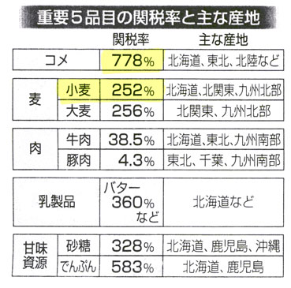
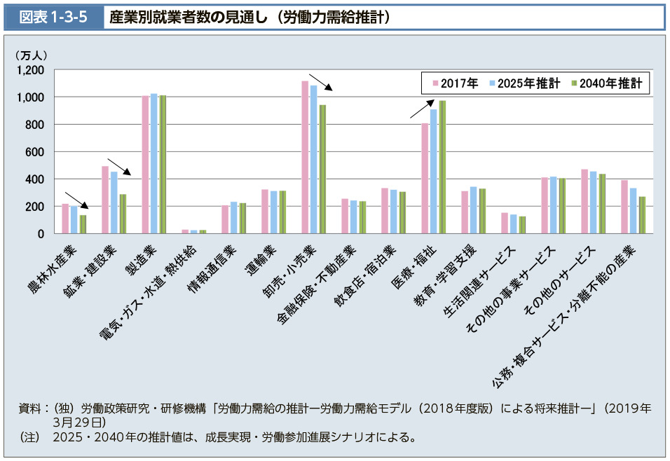
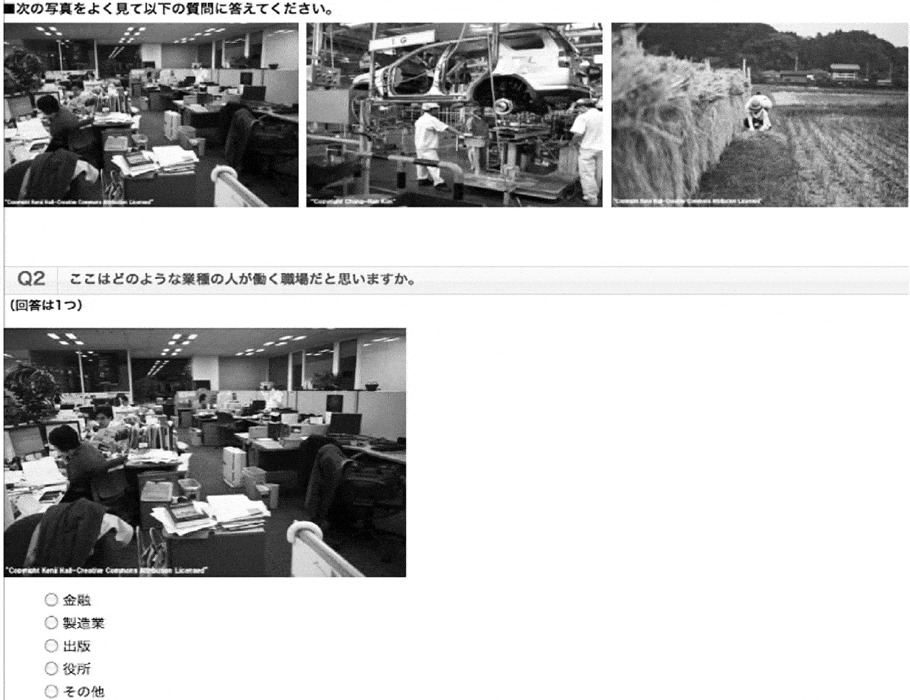
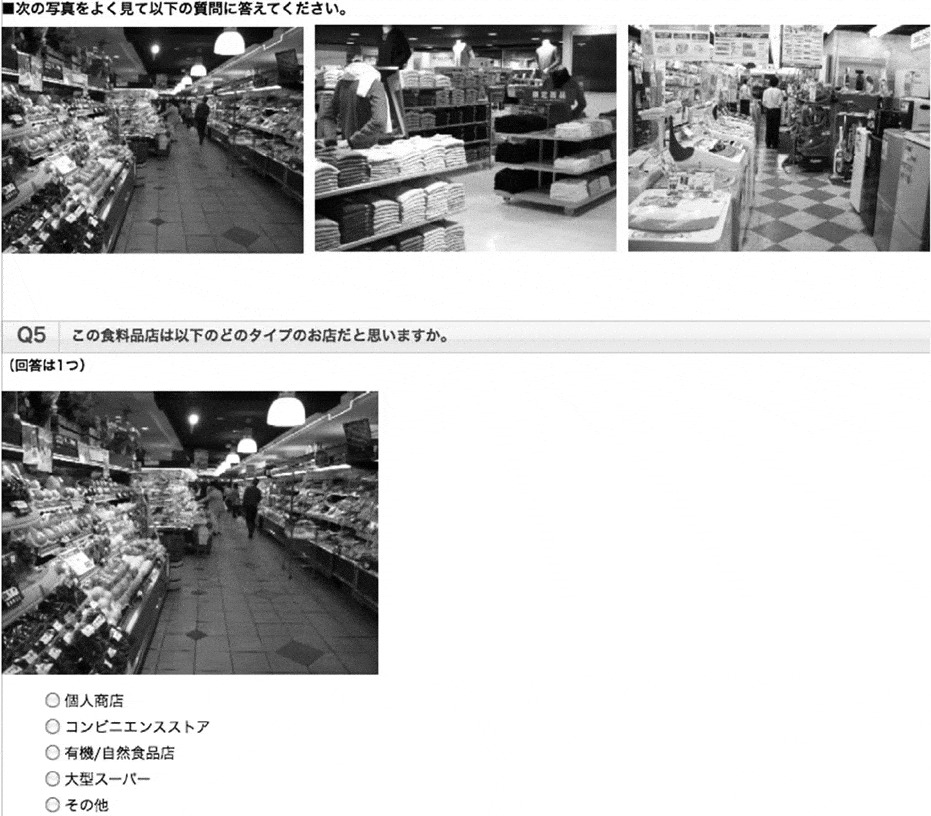
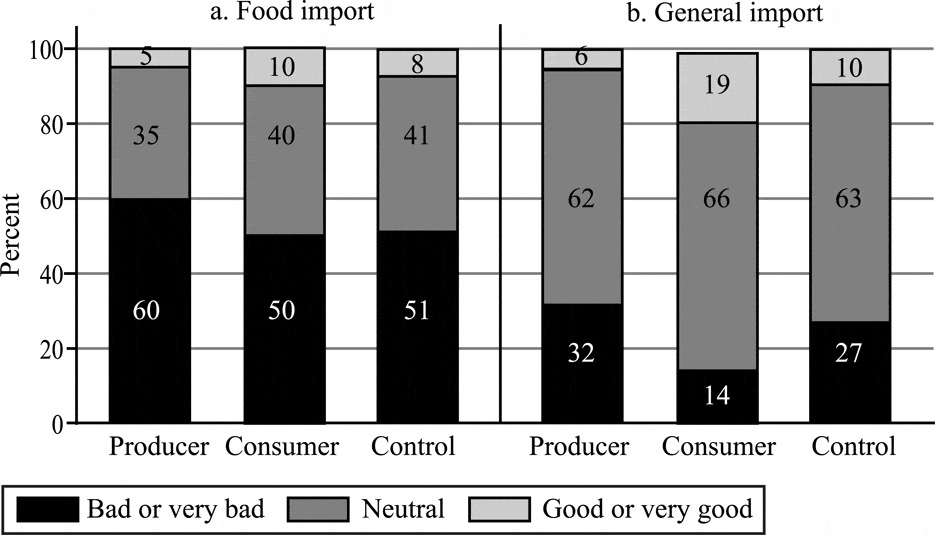

## 今日の目次

1. はじめに
1. 保護主義とは何か
1. 保護主義のパラドックス
1. 集合行為論
1. 保護主義研究の新潮流
1. まとめ

# はじめに
::: {.notes}
目標15分

:::

## 先週のRPより
TBD

## 本日の目的と到達目標
#### 目的
保護主義の実情について概観するとともに、集合行為理論やより最新の研究動向からその政治的な強さを考察する。

::: {.fragment .fade-in}
#### 到達目標
1. 保護主義とは何かを説明した上で、実際に使われる保護主義的手段を3つ以上列挙できる。
1. 集合行為論におけるフリーライダー問題とは何かを説明できる。
1. 集合行為論に基づいて、保護主義の政治的な強さの理由を説明できる。
1. サーベイ実験を用いた研究成果に基づいて、保護主義の政治的な強さの理由を説明できる。

:::

## 本日の授業の位置付け

# 保護主義とは何か
::: {.notes}
ここまで15分

目標15分
:::

## 保護主義 (protectionism)
自国産業を保護するという名目のもと、自由貿易に対して制限を課そうとする政策的立場や動き

::: {.fragment .fade-in}
Q. 保護主義に用いられる政策手段としてはどのようなものがあるでしょうか
:::

## 保護主義の手段
::: {.incremental}
1. **関税**…輸入品にかかる税金
   - 従量税vs.従価税
1. **非関税的措置**…関税以外の手段
   - **数量制限**…輸入量に対する制限
   - **為替管理**…輸出入に必要な外貨を政府が集中管理
   - **為替操作**…輸出促進のために自国通貨安に誘導
      - **近隣窮乏化政策** (beggar thy neighbour)
   - [**非関税障壁**](https://www.youtube.com/watch?v=5SlgoyrAmwo)…法的規制などにより輸入を阻害

:::

::: {.fragment .fade-in}
数量制限が最も貿易阻害効果が高い

::: {.incremental}
 - GATT第11条1項「**数量制限は原則禁止**」
 - ウルグアイラウンドの**包括的関税化** (tariffication)

:::
:::

## 保護主義の歴史
::: {.incremental}
- **重商主義**（〜18世紀）…貿易黒字のための保護主義奨励
   - 航海法と穀物法
- **ブロック経済**（1930年代）…列強の閉鎖経済化
   - 世界恐慌とホーレー＝スムート関税法
- **南北問題**（1960年代）…発展途上国の**輸入代替工業化**
- **新保護主義**（70年代〜）…**アメリカ**の保護主義化
   - 日米貿易摩擦、ブレトン＝ウッズ体制崩壊…
   - 米中貿易戦争、トランプ…

:::

# 保護主義のパラドックス
::: {.notes}
ここまで30分

目標15分
:::
## 質問
日本の主要5品目の関税率の表と産業別就業者数のグラフを見てください。

::: {.incremental}
1. 関税率の表からはどういうことが読み取れますか。
1. 産業別労働者数から、農業従事者についてどういうことが読み取れますか。
1. 読み取れた2つのことからどういう解釈が導けますか。

:::

## 日本の農産品関税率
{.r-stretch}

## 日本の産業別就労者数
{.r-stretch}

# 集合行為論
::: {.notes}
ここまで45分

休憩5分

目標20分
:::

## 質問
各自食べ物や飲み物を持ち寄るパーティ（ポットラック）を開催することになりました。

::: {.incremental}
1. 参加者が5人の場合、食べ物や飲み物を持って行きますか。
1. 参加者が50人の場合はどうですか。

:::

## オルソン『集合行為論』[^olson1965]
::: {.columns}

::: {.column width=65%}
#### 集合行為 (collective action)
ある集団の共通の利益を達成するための行動

::: {.incremental}
- **フリーライダー問題**…合理的な個人は集合行為から逃れる誘因をもつ
- **規模の原理**…小さい集団の方がフリーライダー問題は発生しにくい
- **選択的誘因**によりフリーライダー問題の発生を抑止可能
   - 対価を支払った人だけに対する利益

:::
:::

::: {.column width=30%}
{width=70%}

**Mancur Olson**

(1932-98)
:::

:::

[^olson1965]: Olson, Mancur. 1965. *The Logic of Collective Action: Public Goods and the Theory of Groups*

## Think-pair-share (-10分)
今学んだ集合行為論から、保護主義のパラドックスがどう説明できるか考えてみてください。

::: {.fragment .fade-in}
1. **Think** (1m)…一人で考える
1. **Pair** (3m)…ペアで共有する
1. **Share** (1-2m)…全体に共有する

:::

## 保護主義と集合行為

#### 保護主義のパラドックス
農業従事者が少ないにも関わらず農産品における保護主義が強い

::: {.fragment .fade-in}
集合行為論「農業従事者が少ないからこそ保護主義が強い」

:::

::: {.fragment .fade-in}

| 集団   | 選好     | 規模   | フリーライド | 
| ------ | -------- | ------ | ------------ | 
| 生産者 | 保護主義 | 小さい | する         | 
| 消費者 | 自由貿易 | 大きい | しない       | 

:::

# 保護主義研究の新潮流
::: {.notes}
ここまで70分（1:10）

目標20分
:::

## 質問
一般的にモノを海外から輸入することは、いいことだと思いますか。それとも悪いことだと思いますか。

食料品を海外から輸入することは、いいことだと思いますか。それとも悪いことだと思いますか。

## 直井・久米（2011）[^naoi2011]
::: {.fragment .fade-in}
問題設定：

::: {.incremental}
- 幅広い農業保護主義世論
   - 日本人の37.8%「農産品の輸入に対する規制はやむを得ない」
- 生産者と消費者の二分法に誤り？
    - 消費者であると同時に生産者

:::
:::

::: {.fragment .fade-in}
仮説：自分が生産者であると意識するか消費者であると意識するかで、自由貿易に対する態度は変わる

:::

::: {.fragment .fade-in}
研究方法：**サーベイ実験**

::: {.incremental}
- 世論調査に実験を組み込んだ手法

:::
:::

[^naoi2011]: Naoi, Megumi, and Ikuo Kume. 2011. “Explaining Mass Support for Agricultural Protectionism: Evidence from a Survey Experiment During the Global Recession.” *International Organization 65*(4): 771-95.

## 質問
ある日あなたは風邪をひき38度の熱が出ました。

その時おばあちゃんが手作りの薬をくれました。

これを飲んだところ、次の日には本当に36.5度まで熱が下がりました。

この薬に効果はあったと結論づけて良いでしょうか？

## 直井・久米の実験
::: {.fragment .fade-in}
オンラインの世論調査

::: {.incremental}
- 食糧輸入／輸入一般に対する賛否

:::
:::

::: {.fragment .fade-in}
回答者1200人をランダムに以下のグループに分割

::: {.incremental}
1. **統制群**：何も見せずに回答
1. **処置群①**：生産者意識を刺激する画像を見て回答
1. **処置群②**：消費者意識を刺激する画像を見て回答

:::
:::

## 実験刺激と結果
::: {.r-stack}
{.fragment}

{.fragment}

{.fragment}
:::

::: {.notes}
結果：

- 食糧輸入に対しては輸入一般よりも否定的
- 生産者刺激は食糧輸入への否定感を強める
- 消費者刺激は輸入一般への肯定感を強める
- 生産者刺激の効果が人によって違う
:::

# まとめ
::: {.notes}
ここまで90分（1:30）

目標10分
:::

## 本日の目的と到達目標
#### 目的
保護主義の実情について概観するとともに、集合行為理論やより最新の研究動向からその政治的な強さを考察する。

::: {.fragment .fade-in}
#### 到達目標
1. 保護主義とは何かを説明した上で、実際に使われる保護主義的手段を3つ以上列挙できる。
1. 集合行為論におけるフリーライダー問題とは何かを説明できる。
1. 集合行為論に基づいて、保護主義の政治的な強さの理由を説明できる。
1. サーベイ実験を用いた研究成果に基づいて、保護主義の政治的な強さの理由を説明できる。

:::

## 次回までに

#### 事後学習

 - 授業資料を見直し、目標到達をセルフチェック
 - Moodle上でのリアクションペーパー入力（木曜日まで）
