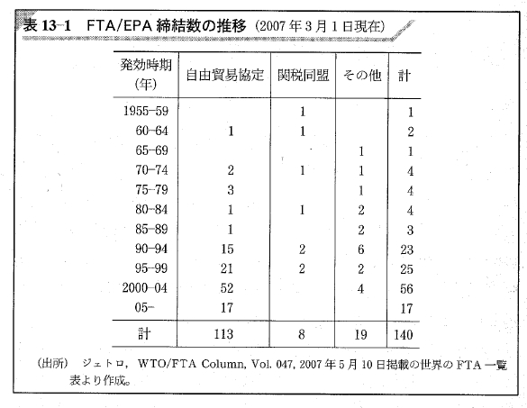
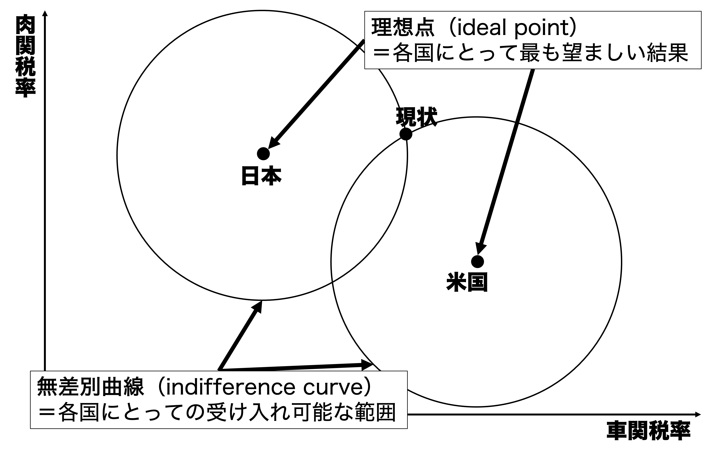
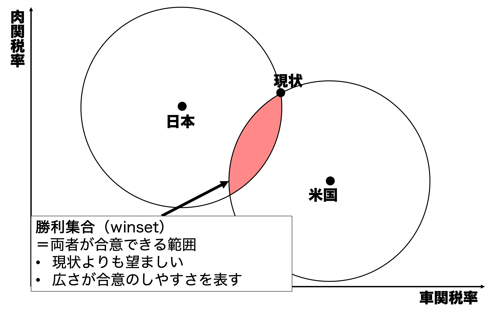
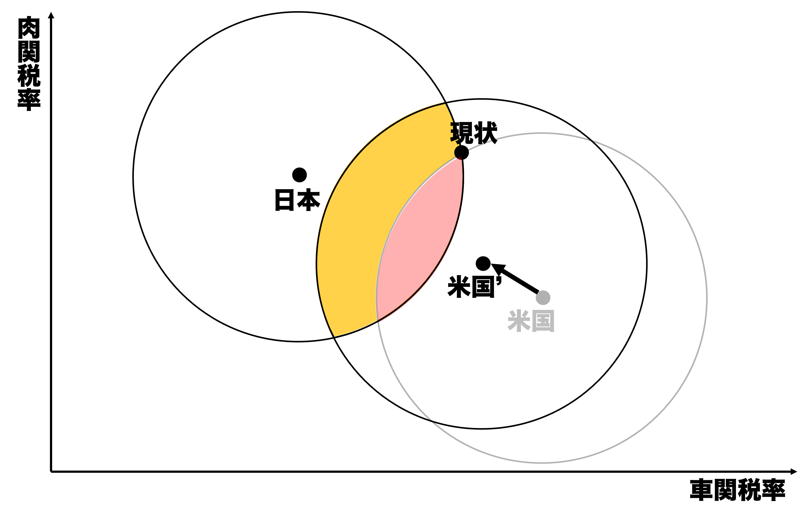
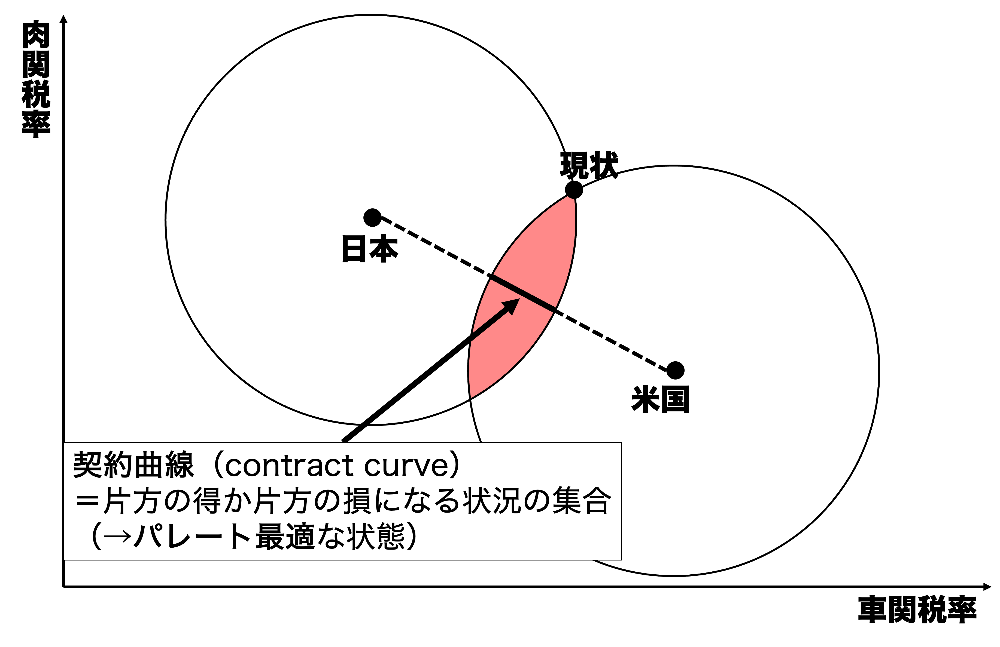
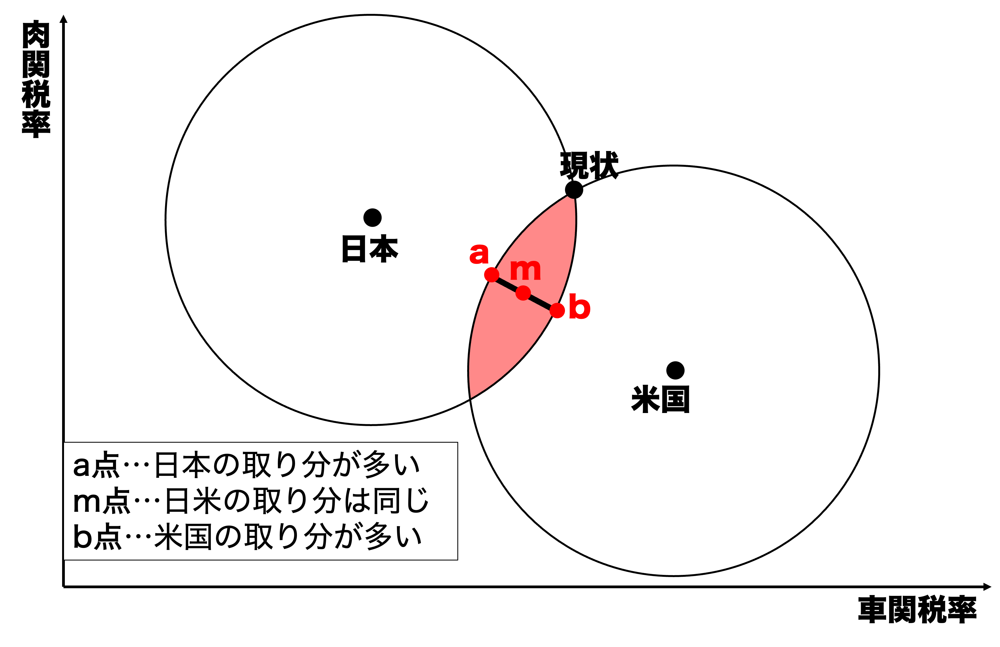
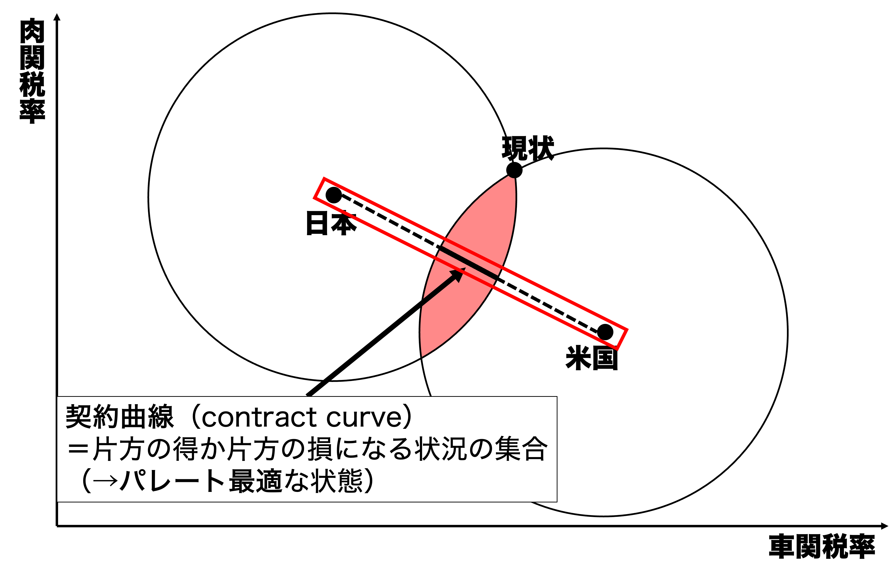
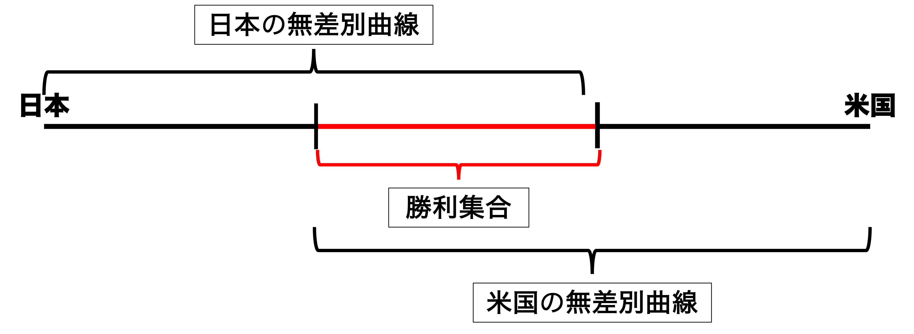
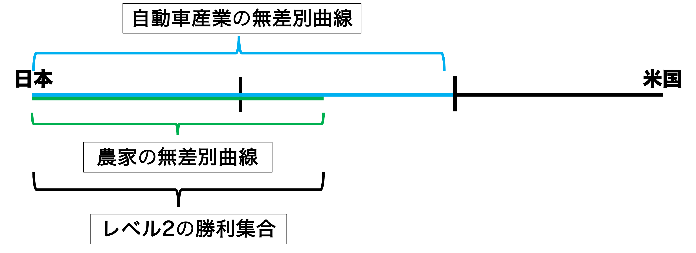
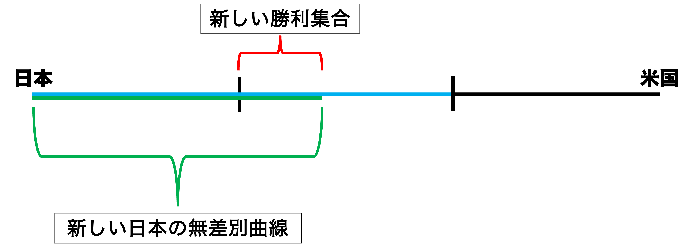

## 今日の目次

1. はじめに
1. 貿易交渉の現況
1. 空間モデルの概要
1. 空間モデルと分配問題
1. 2レベルゲーム
1. まとめ

# はじめに
::: {.notes}
目標15分

:::

## 先週のRPより
TBD

## 本日の目的と到達目標
#### 目的
貿易をめぐる国家間交渉の実情を概観するとともに、空間モデルや2レベルゲーム論を学んで交渉の成否を理論的に考察する。

::: {.fragment .fade-in}
#### 到達目標
1. 貿易交渉について、GATT体制での原則とドーハラウンド後の実情を説明できる。
1. 空間モデルに基づいて、貿易交渉の成立のしやすさを議論できる。
1. 貿易交渉における交渉力の源泉を3つ列挙できる。
1. 2レベルゲーム論に基づいて、政治体制と交渉力の関係を議論できる。

:::

## 本日の授業の位置付け

# 貿易交渉の現況
::: {.notes}
ここまで15分

目標15分
:::

## GATT体制と貿易交渉
GATT体制…**多国間主義**に基づく戦後の自由貿易体制（次週）

::: {.incremental}
- **多角的貿易交渉**（ラウンド）
   - 加盟国が一堂に会して貿易交渉
   - ケネディ、東京、ウルグアイ…
- 二国間や地域内での交渉・協定は例外
   - 一定の条件を満たす必要
   - 戦前のブロック経済の反省

:::

## FTA/EPA/関税同盟の締結数
{.r-stretch}

::: {.notes}
問いかけ（GATT体制の概要の後）

- 目的：戦後の多国間主義が二国間・地域主義に取って代わられたことに気づく
- 質問「（FTA /EPA締結数の推移の表を見せつつ）これは二国間のFTA（EPA含む）と複数国の関税同盟の締結数の推移です。何が読み取れますか。」
- 進行：0.5-1分考える→1人に当てる
:::

## シアトルの挫折とドーハラウンド
::: {.columns}
::: {.column width=65%}
::: {.fragment .fade-in}
1999年11〜12月　**シアトル閣僚会議**

::: {.incremental}
- 史上初めて新ラウンド開催できず
- **反グローバリズム**…労働者保護や環境問題への懸念

:::
:::

::: {.fragment .fade-in}
2001年11月　**ドーハ閣僚会議**

::: {.incremental}
- 9.11テロからの復興を目指す
- 153カ国の参加→**ドーハラウンド**の開始
   - 正式「**ドーハ開発アジェンダ**」

:::
:::
:::

::: {.column width=35%}

:::

:::

## ドーハラウンドの挫折
::: {.fragment .fade-in}
2006年7月　交渉の無期限中断

::: {.incremental}
- 部分的な合意を積み重ねる「**新しいアプローチ**」＝事実上の頓挫
- 先進国と途上国の対立
   - 農業自由化、鉱工業自由化、投資環境整備が争点

:::
:::

::: {.fragment .fade-in}
以降、二国間・地域間協定の活発化

::: {.incremental}
- 自由貿易協定／経済連携協定
- 地域経済統合

:::
:::

# 空間モデルの概要
## 空間モデル (spatial model)
交渉の成否や結果を予測するためのモデル

::: {.incremental}
- 交渉当事者を物理的な空間上に位置付け

:::

::: {.fragment .fade-in}
主張：

::: {.incremental}
- 交渉当事者間の**距離**が大きくなると**交渉成立の可能性**が低くなる
- 交渉当事者間の**受け入れ可能な範囲**が大きくなると**交渉成立の可能性**が高くなる

:::
:::

## 日米貿易交渉の例
**日本**と**米国**が**車**と**米**の関税率を巡って交渉

::: {.fragment .fade-in}
::: {.panel-tabset}
#### 空間モデル
{width=70%}

#### 理想点他
{width=70%}

#### 勝利集合
{width=70%}

#### 変化①
{width=70%}

#### 変化②
{width=70%}
:::
:::

::: {.notes}
クイズ（勝利集合の説明の後）

- 目的：空間モデルの主張を理解する
- 質問①「今他の条件は同じとして、アメリカの理想点と無差別曲線が日本側に近づいたとします。勝利集合の大きさはどうなるでしょうか？」→広がる
- 質問②「今他の条件は同じとして、アメリカの無差別曲線が小さくなったとします。勝利集合の大きさはどうなるでしょうか？」→小さくなる

:::

  
# 空間モデルと分配問題
## 分配問題
勝利集合の中でどの結果になるか

::: {.fragment .fade-in}
::: {.panel-tabset}
#### 契約曲線
{width=70%}

#### 解説
{width=70%}

:::
:::

## クイズ

今自動車ディーラーの営業マンがお客さんと商談中です。

::: {.incremental}
1. 営業マンはあと1週間でもう1台の売り上げを作る必要があります。他方、お客さんは3ヶ月以内に納車して欲しいと考えています。この時、営業マンとお客さんはどちらが有利ですか？
1. お客さんは別のディーラーが近くにあり、そこでも商談をしたことがあると営業マンに伝えました。この時、営業マンとお客さんはどちらが有利になりましたか？
1. お客さんが「奥さんに『予算は200万以内、それ以上の車を買ったら離婚する』と言われた」と営業マンに伝えました。もしこれが本当だとすると、営業マンとお客さんはどちらが有利だと思いますか？

:::

## 交渉力 (bargaining power)
分配問題における取り分を決定する力

::: {.incremental}
- **忍耐**…今交渉に合意する必要がない
- **他の選択肢**…この交渉でなくても他に相手がいる
- **私的情報**…自分の情報を隠せる
   - ただし交渉不成立のリスク

:::

## 私的情報戦略

::: {.notes}
私的情報戦略は空間モデル上で解釈可能

- アメリカが「国内の反対勢力」を言い訳に、無差別曲線を小さく見せかける
- 日本がもし信じたとすれば勝利集合は赤の網掛け
   - 全体的にアメリカに近い→アメリカに有利な条件
- ただし勝利集合は小さくなる→交渉は成立しにくい
   - 日本が同じことをすればより小さくなる
:::

# 2レベルゲーム
## 2レベルゲーム (two-level game)
::: {.columns}
::: {.column width=70%}
**ロバート・パットナム**の提唱[^putnam1988]

::: {.fragment .fade-in}
**国際交渉**の中に**国内の視点**を導入

::: {.incremental}
- **レベル1**ゲーム…国家同士の交渉
- **レベル2**ゲーム…国内における交渉

:::
:::

::: {.fragment .fade-in}
国家を一枚岩と見ない点で**リベラル**

:::

:::

::: {.column width=30%}

:::

:::

[^putnam1988]: Putnam, R. D. (1988). Diplomacy and Domestic Politics: The Logic of Two-Level Games. *International Organization, 42*(3), 427-460.

## 日米2レベル貿易交渉
車と米の関税率交渉

::: {.incremental}
- レベル1…日本と米国
- レベル2…日本国内の農家と自動車産業

:::

::: {.fragment .fade-in}
::: {.panel-tabset}
#### 契約曲線①
{width=60%}

#### 契約曲線②

#### レベル2交渉

#### レベル1交渉

:::
:::

## 2レベルゲームの含意
**国内の多様性**が**強い交渉力**をもたらす

::: {.incremental}
- 強硬派の存在→狭い無差別曲線→有利な勝利集合
- ただし同時に失敗可能性も高い

:::

::: {.fragment .fade-in}
#### Think-pair-share (-10分)

2レベルゲーム論を踏まえると、民主主義国家と権威主義国家どちらが有利か？

1. **Think** (1分)…1人で考える
1. **Pair** (2-3分）…ペアで考える
1. **Share** (2-3分）…全体に共有

:::

# まとめ
## 本日の目的と到達目標
#### 目的
貿易をめぐる国家間交渉の実情を概観するとともに、空間モデルや2レベルゲーム論を学んで交渉の成否を理論的に考察する。

::: {.fragment .fade-in}
#### 到達目標
1. 貿易交渉について、GATT体制での原則とドーハラウンド後の実情を説明できる。
1. 空間モデルに基づいて、貿易交渉の成立のしやすさを議論できる。
1. 貿易交渉における交渉力の源泉を3つ列挙できる。
1. 2レベルゲーム論に基づいて、政治体制と交渉力の関係を議論できる。

:::

## 次回までに

#### 事後学習

 - 授業資料を見直し、目標到達をセルフチェック
 - Moodle上でのリアクションペーパー入力（木曜日まで）