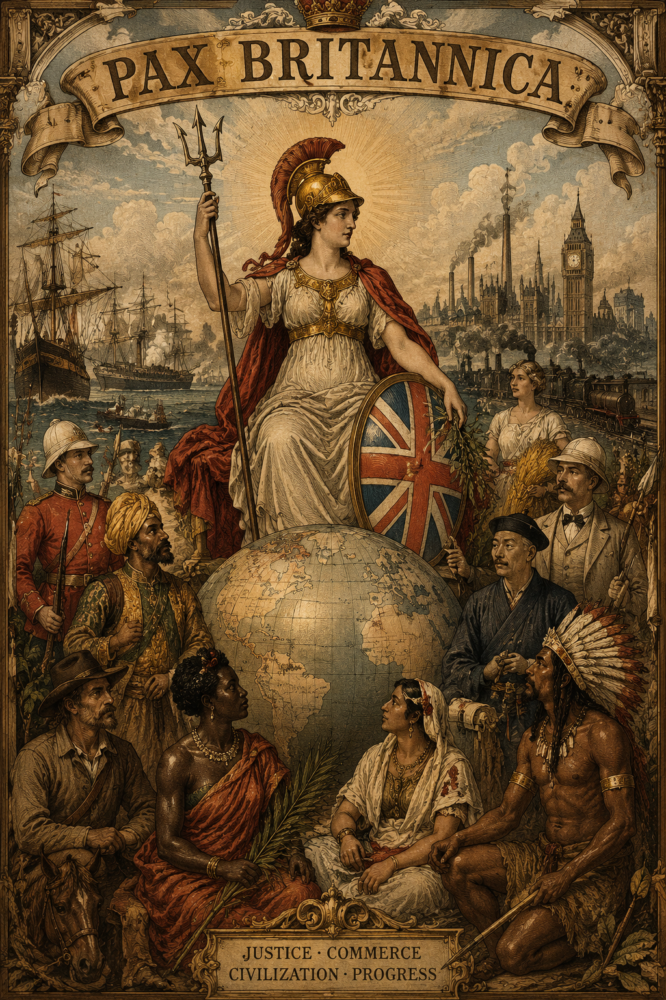
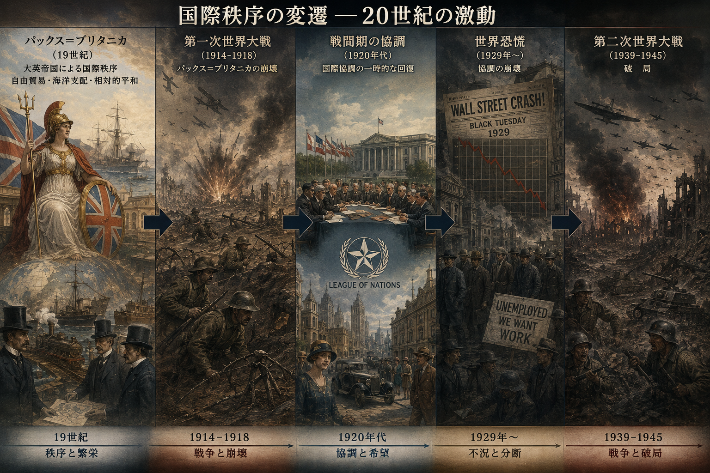

## 今日の目次

1. はじめに
1. GATTの成立
1. GATTの全体像
1. GATTからWTOへ
1. 二国間主義と多国間主義
1. まとめ

# はじめに
::: {.notes}
目標15分

:::

## 先週のRPより (1/2)
> 2レベルゲーム論において、民主主義国は国内の多様性が範囲を狭め、私的情報も隠すことで交渉力が高いとかんがえられているが、それは果たして有利に働くのかという点が疑問だった。民主主義国は情報が比較的オープンなので様々な団体からの圧力によって狭められた範囲がそのまま底値として明らかになってしまうのではないかと感じた。

::: {.notes}
民主主義体制＝情報の透明性が高い

- 私的情報は隠せない→実際には交渉力には両義性
   - コミットメント問題の解決→民主的平和論（後期）
   - 私的情報戦略は使えない→実際より受け入れ可能範囲を狭く見せようとしても無理
   
:::

## 先週のRPより (2/2)
> 授業内容に基づけば、多国間主義の実現のためには各国の交渉力が低い方が好ましいと推測できるが、権威主義国家の方が交渉力が低いとすれば権威主義国家が増えれば多国間主義の実現に近づくことになるのだろうか。

::: {.fragment .fade-in}
> ドーハラウンドの挫折以降、GATTでは二か国・地域間の協定が中心となってきたが、ウクライナ侵攻、イスラエルのガザ侵攻、そしてアメリカの介入以降の国際秩序の変動を踏まえると、GATTの本来の目的が再び果たされ、多国間交渉の長期的停滞が解消される日は来るのだろうか

:::

::: {.notes}
権威主義国家と多国間主義

- 確かに先週の話に基けば、受け入れ可能な範囲が広い→交渉力が低い
- しかし多くの権威主義国家は国際秩序に挑戦的
   - 独裁者の向こう見ずな行動に対して抑制できない
- 民主主義の後退と国際秩序の揺らぎ

:::

## 本日の目的と到達目標
#### 目的
戦後の自由貿易体制であるGATTの歴史的展開や現状を概観するとともに、その多国間主義原則について理論的に考察する。

::: {.fragment .fade-in}
#### 到達目標
1. ハバナ憲章をめぐる混乱を踏まえて、GATT体制がどのような性格を持って成立したかを説明できる。
1. GATTの基本原則を3つ列挙し、それぞれ説明できる。
1. 紛争処理手続きに着目して、GATTがWTOに再編された理由を説明できる。
1. GATTの多国間主義のメリットを二国間主義と比較しながら説明できる。

:::

## 本日の授業の位置付け

# GATTの成立
::: {.notes}
ここまで15分

目標20分
:::
## Think-pair-share
9世紀から第二次世界大戦に至るまでの貿易をめぐる国際秩序の展開を次のキーワードから説明してみてください。

**キーワード：**パックス・ブリタニカ、金本位制、古典派経済学、ヤング案とドーズ案、世界恐慌、ブロック経済

- **Think** (1分)
- **Pair** (2-3分)
- **Share** (2-3分)

<!-- ## 復習：パックス・ブリタニカの興亡 -->
<!-- ::: {.columns} -->
<!-- ::: {.column width=75%} -->
<!-- ::: {.fragment .fade-in} -->
<!-- #### パックス・ブリタニカ (Pax Britannica) -->
<!-- イギリスの覇権の下で国際関係が安定していた19世紀から第一次世界大戦までの時代 -->

<!-- ::: {.incremental} -->
<!-- - 圧倒的な**海軍力**による安全保障 -->
<!-- - **自由貿易主義**の執行←古典派経済学 -->
<!-- - **金本位制** -->

<!-- ::: -->
<!-- ::: -->

<!-- ::: {.fragment .fade-in} -->
<!-- 帰結＝[貿易量の飛躍的増大](https://junpei-suzuki.github.io/IPE1-2026-Gakushuin/04_pax_britannica_slide.html#/%E6%AC%A7%E5%B7%9E%E3%81%AE%E8%B2%BF%E6%98%93-1815-1949) -->

<!-- ::: -->

<!-- ::: -->

<!-- ::: {.column width=25%} -->
<!--  -->
<!-- ::: -->

<!-- ::: -->

<!-- --- -->

<!-- ::: {.columns} -->
<!-- ::: {.column width=70%} -->

<!-- 1914-18年　**第一次世界大戦** -->

<!-- ::: {.incremental} -->
<!-- - 貿易制限と金本位制の停止 -->
<!-- - イギリスの覇権の失墜 -->
<!-- ::: -->

<!-- ::: {.fragment .fade-in} -->
<!-- 1919-29年　**戦間期の協調** -->

<!-- ::: {.incremental} -->
<!-- - ヤング案とドーズ案 -->

<!-- ::: -->
<!-- ::: -->

<!-- ::: {.fragment .fade-in} -->
<!-- 1919年　**世界恐慌** -->

<!-- ::: {.incremental} -->
<!-- - 金本位制再停止 -->
<!-- - ブロック経済 -->

<!-- ::: -->
<!-- ::: -->

<!-- ::: {.fragment .fade-in} -->
<!-- 1939-45年　**第二次世界大戦** -->

<!-- ::: -->

<!-- ::: -->

<!-- ::: {.column width=30%} -->
<!--  -->
<!-- ::: -->

<!-- ::: -->

## 復習：パックスブリタニカの興亡

## GATTの成立

1941年　**大西洋憲章**

::: {.incremental}
- 戦後秩序に関する米英合意
- 埋め込まれた自由主義

:::

::: {.fragment .fade-in}
1944年　**ブレトン・ウッズ会議**

::: {.incremental}
- 自由貿易促進のための固定相場制構築
- **ブレトン＝ウッズ体制**…ドルを基軸通貨に

:::

:::

::: {.fragment .fade-in}
1947年　**ハバナ憲章**

::: {.incremental}
- **国際貿易機関** (ITO)の設立に合意
- しかし米英の国内世論の反発で発効できず

:::
:::

---

::: {.columns}
::: {.column width=70%}

1948年　**関税及び貿易に関する一般協定**

::: {.incremental}
  - **G**eneral **A**greement on **T**ariffs and **T**rade
  - ハバナ憲章の一部（貿易・関税と紛争処理）を暫定的に発効
  - 1995 年に**世界貿易機関 (WTO) **へと発展

:::

:::

::: {.column width=30%}

:::

:::

# GATTの全体像
::: {.notes}
ここまで35分

目標15分
:::
## 質問
[第5回のスライド](https://junpei-suzuki.github.io/IPE1-2026-Gakushuin/05_postwar_slide.html)を見て、埋め込まれた自由主義とはどのようなものか改めて確認してください。

## GATTの基本原則
**多国間主義**に基づく自由貿易の推進

::: {.incremental}
- **一般的最恵国待遇**（第1条）…締約国が他の締約国に与えた利益を残りの締約国に対して「即時かつ無条件に」与えなければならない。
- **内国民待遇**（第3条）…輸入品は国内産品と同様に扱わなければならない。
- **数量制限の一般的禁止**（第11条1項）…関税以外の輸入規制手段（割当や許可制）は原則禁止。

:::

::: {.notes}
最恵国待遇

- 具体的には各国は「譲許表」をGATT事務局に提出
- これが全ての締約国に対して自動的に適用
- この譲許表に反して関税を引き上げることはできない

内国民待遇

- 関税ではない形の差別的な扱いの禁止
- 例：外国産の製品に消費税20%

:::

## 基本原則の例外
埋め込まれた自由主義→**国家の自律性**への配慮

::: {.incremental}
- **農産物**における数量制限の容認（第11条2項）
- **国際収支悪化を防止**するための制限（第12条）
- **農業補助金**の容認（第16条）
- **発展途上国による制限**の容認（第18条）
- 特定の産品に関する**緊急制限措置**（第19条）
   - いわゆる「**セーフガード**」
      - 例：[ねぎ・生しいたけ・畳表](https://www.maff.go.jp/j/kokusai/boueki/sg_kanren/pdf/zantei.pdf)（2001年）

:::

## 多角的貿易交渉（ラウンド）
加盟国が一堂に会して自由化交渉

::: {.fragment .fade-in}
::: {style="font-size: 0.9em;"}
| ラウンド           | 時期 | 概要                                                     | 
| :----------------- | :------- | -------------------------------------------------------- | 
| **第1-5回**    | 1947-62  | **品目別交渉**→自由化停滞（-26カ国)                         | 
| **ケネディ**   | 1964-67  | **一括交渉**の開始 (74カ国)                                  | 
| **東京**       | 1973-79  | **非関税障壁**も交渉対象に (82カ国)                          | 
| **ウルグアイ** | 1986-94  | **農産品・サービス貿易**の自由化、**WTO設立** (93カ国)           | 
| **ドーハ**     | 2001-    | **環境保護・投資環境の整備**など、08年に**事実上頓挫** (153カ国) | 

:::
:::

::: {.notes}
- 交渉様式：品目別交渉→一括交渉
- 参加国：先進国のみ→途上国も参加
- 対象手段：関税→非関税障壁
- 対象品目：鉱工業品のみ→農産品・サービスも含む

:::

# GATTからWTOへ
::: {.notes}
ここまで50分

休憩5分

目標15分
:::
## 質問
[第5回のスライド](https://junpei-suzuki.github.io/IPE1-2026-Gakushuin/05_postwar_slide.html)を見て、1970年代以降に戦後国際秩序がどのような変容を経験したのか改めて確認してください。

## GATT紛争処理手続き
基本的な流れ

::: {.incremental}
1. 当事者間協議
1. 紛争処理小委員会（**パネル**）の設置
1. パネル勧告案の採択

:::

::: {.fragment .fade-in}
**コンセンサス方式**…すべての国が拒否権

::: {.incremental}
- パネル設置、勧告案採択で要求
- 不利な側の妨害→機能不全

:::
:::

## GATTからWTOへ

1960年代〜　アメリカの**経常赤字**→ドル信用低下

::: {.incremental}
 - ベトナム戦争の長期化
 - 旧敗戦国の経済復興
 - 国内福祉の拡大

:::

::: {.fragment .fade-in}
70年代〜　アメリカの**新保護主義**

::: {.incremental}
 - 1971年　**ニクソン・ショック**
    - 金ドル交換の一時停止→ブレトン・ウッズ体制の崩壊
  - 1974年　**通商法301 条**（Section 301）
    - 「貿易不公正国」に対する制裁
    - 機能不全の紛争処理手続きを回避

:::
:::

---

::: {.columns}
::: {.column width=70%}

1995年　**世界貿易機関**（World Trade Organization: WTO）発足

::: {.incremental}
  - ウルグアイラウンドでGATTを発展的改組
  - 米による紛争処理手続き改善要求
     - **ネガティブ・コンセンサス方式**…全加盟国が反対しない限り提案が採択

:::

:::

::: {.column width=30%}

:::

:::

# 二国間主義と多国間主義
::: {.notes}
ここまで70分(1:10:00)

目標20分
:::
## GATTと相互主義

::: {}
基本原則…**多国間主義**に基づく自由貿易の推進

::: {.incremental}
- 一般的最恵国待遇、内国民待遇、数量制限の一般的禁止
- 多角的貿易交渉（ラウンド）

:::
:::

::: {.fragment .fade-in}
::: {.columns}
::: {.column width=75%}
ロバート・コヘインの**相互主義**(reciprocity)分析[^keohane1986]

::: {.incremental}
- 特定相互主義
- 拡散相互主義

:::

:::

::: {.column width=25%}

:::

:::

:::

[^keohane1986]: Keohane, R. O. (1986). Reciprocity in international relations. *International Organization, 40*(1), 1-27.

## 特定相互主義 (specific reciprocity)
**特定のパートナー同士**が**比較的同時**にお互いに**同価値**のものを交換すること

::: {.fragment .fade-in}
二国間交渉が典型例

::: {.incremental}
- 例：2030年までの日米相互関税撤廃合意
   - 特定のパートナー：日米
   - 同時性：2030年までに
   - 同価値の交換：相互に関税撤廃

:::
:::

## Think-pair-share
日本がアメリカ、中国、EU、韓国と貿易の自由化を目指して交渉するとします。

1. 各国と個別交渉を繰り返して自由化を目指すとしたら、どのような問題が起きそうですか。
1. もしこれらの国が同じ会議に集まって一括で交渉したとしたら何かメリットはあるでしょうか。

## 拡散相互主義 (diffuse reciprocity)
単独の相手ではなくグループ全体相手に、だいたい同じ価値と思えるものを、必ずしも同時ではないタイミングで交換すること

::: {.fragment .fade-in}
**GATTの多国間主義**はこちら

::: {.incremental}
 - ラウンドの一括関税引き下げ…先進国が途上国に一方的に譲歩
      - 「出世払い」的な意図

:::
:::

::: {.fragment .fade-in}
利点…特定相互主義の問題解決

::: {.incremental}
- **取引費用**の削減
- **長期的な信頼関係**の構築

:::
:::

::: {.fragment .fade-in}
問題…**フリーライダー問題**

:::

# まとめ
::: {.notes}
ここまで90分(1:30:00)

目標15分
:::
## 先週のRPより
TBD

## 本日の目的と到達目標
#### 目的
戦後の自由貿易体制であるGATTの歴史的展開や現状を概観するとともに、その多国間主義原則について理論的に考察する。

::: {.fragment .fade-in}
#### 到達目標
1. ハバナ憲章をめぐる混乱を踏まえて、GATT体制がどのような性格を持って成立したかを説明できる。
1. GATTの基本原則を3つ列挙し、それぞれ説明できる。
1. 紛争処理手続きに着目して、GATTがWTOに再編された理由を説明できる。
1. GATTの多国間主義のメリットを二国間主義と比較しながら説明できる。

:::

## 次回までに

#### 事後学習

 - 授業資料を見直し、目標到達をセルフチェック
 - Moodle上でのリアクションペーパー入力（木曜日まで）