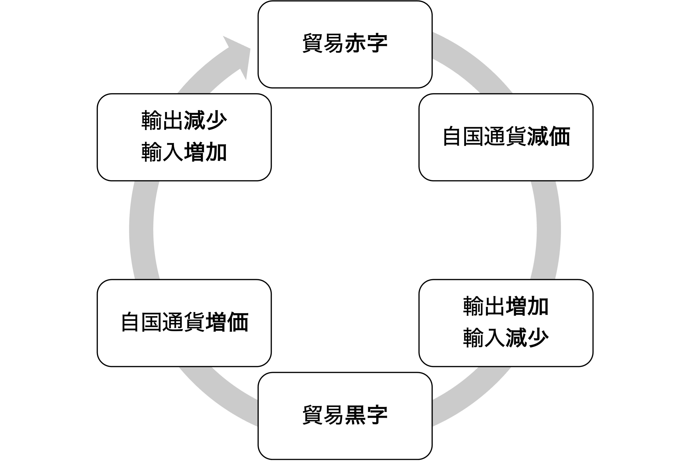
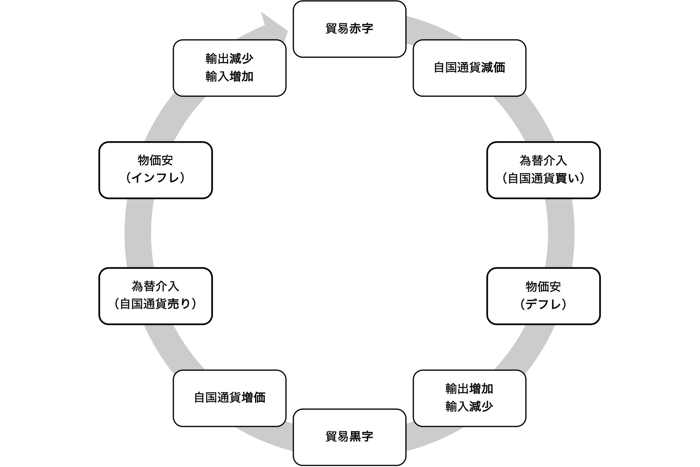
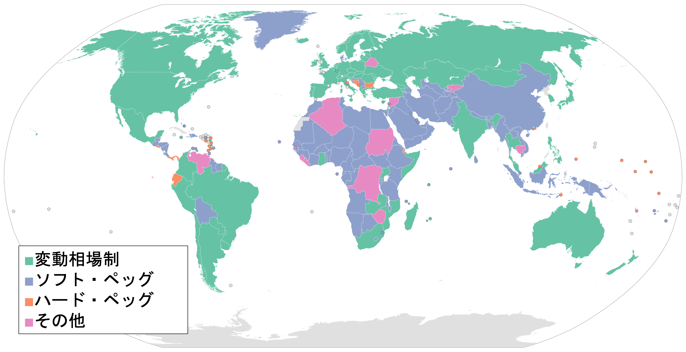
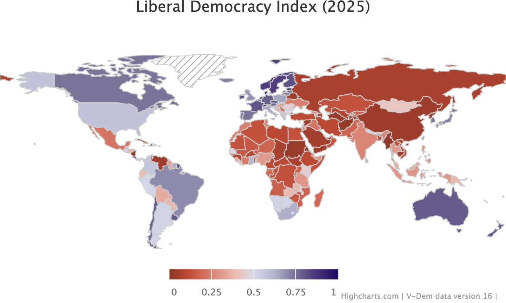
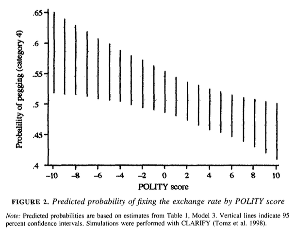

## 今日の目次

1. はじめに
1. 為替制度の概要
1. 変動相場制
1. 固定相場制
1. 為替制度選択と政治体制
1. まとめ

# はじめに
::: {.notes}
目標15分

:::

## 先週のRPより
TBD

## 本日の目的と到達目標
#### 目的
固定相場制と変動相場制という2つの為替制度を学んだ上で、国際収支との関係を理解するとともに、為替制度の選択と政治体制の関係を議論する。

::: {.fragment .fade-in}
#### 到達目標
1. 変動相場制と固定相場制とはそれぞれ何か説明できる。
1. 変動相場制における経常収支の調整メカニズムを説明できる。
1. 固定相場制における経常収支の調整メカニズムを説明できる。
1. 政治制度が為替制度の選択にどのように影響をするのか議論できる。

:::

## 本日の授業の位置付け

# 為替制度の概要
## 為替制度 (exchange rate regime)
通貨間の交換比率（為替レート）を決める制度

::: {.fragment .fade-in}
2つの理念型：

::: {.incremental}
- **変動相場制**…為替レートを為替市場で決定されるままにしておく
- **固定相場制**…為替介入によって為替レートを一定の値に固定
   - 「**ペッグ** (peg) する」

:::
:::

::: {.fragment .fade-in}
変動制と固定制で異なる経常収支調整メカニズム（後述）

:::

::: {.fragment .fade-in}
Q. 現在の日本は変動相場制？固定相場制？

:::

## 為替制度のグラデーション
{.r-stretch}

::: {.notes}
中間的制度→実際にはどちらに近いか

- 管理変動相場制…変動相場制を基調としつつ、変動幅を一定程度に抑えておく制度
- 調整可能固定相場制…固定相場制を基調としつつ、固定レートの変更を許容する制度

固定相場制の変種
- 金本位制…一定の比率のもとで自国通貨と金の交換を保証
- 通貨同盟…複数国で共通の通貨を使用し、自国通貨は発行しない
- 自国通貨の放棄…自国通貨を使わず、外国通貨のみ（特に米ドル）を使用
- カレンシー・ボード制…一定の為替レートになるよう、自国通貨の発行量をペッグ相手の通貨と完全に連動

:::

# 変動相場制
## 変動相場制
#### floating exchange-rate system
為替レートを**為替市場**で決定されるままにしておく制度

::: {.fragment .fade-in}
#### 外国為替市場 (foreign exchange market)
通貨同士を売買する金融市場

::: {.incremental}
- 外国のモノを買う→相手国の通貨が必要
   - 手持ちの通貨をと必要な通貨を交換
- 物理的な取引所はない
   - 対顧客市場と銀行間市場
      - ニュースなどの東京外為市場は後者

:::
:::

## クイズ
日本とアメリカの二国間貿易を考えてみましょう。今、日米は別の通貨を使っており、かつ変動相場制を採用しています。

::: {.incremental}
1. 貿易収支が日本の黒字・アメリカの赤字だとします。この時為替市場では日本円とアメリカドルどちらが多く買われていると思いますか？
1. 一般に日本の輸出に有利なのは円安と円高どちらですか？それはなぜですか？

:::

## 変動制における経常収支調整
**為替レート変動**を経由した調整

# 固定相場制
## 固定相場制
#### fixed exchange-rate system
**為替介入**によって為替レートを一定の値に固定する制度

::: {.fragment .fade-in}
#### 為替介入 (foreign exchange intervention)
**通貨当局**が**外貨準備**を使って自国通貨を売買

::: {.incremental}
- 通貨当局⋯その国の財務省や中央銀行など
- 外貨準備⋯通貨当局が保有する外国通貨
  - 日本では「外国為替資金特別会計」
  - 財務大臣の指示で日銀が実施
- 固定レート維持のために、市場の動きとは逆に売買
  - 例：円高ドル安→円売りドル買い

:::
:::

## クイズ
日本とアメリカの二国間貿易を考えてみましょう。今、日米は別の通貨を使っており、かつ固定相場制を採用しています。

::: {.incremental}
1. 日本が輸出超過の時、為替市場における日本円の需要はどうなるでしょうか。
1. 何もしなければ日本円のレートはどのように動くでしょうか。
1. 日本の通貨当局はどのような介入を行うでしょうか。
1. 介入の結果、市場に流通する日本円の総量はどうなるでしょうか。
1. 結果、日本の全般的な物価水準はどうなるでしょうか。

:::

## 固定制における経常収支調整
**物価変動**を経由した調整

# 為替制度選択と政治体制
## 為替制度の分布
Q. 以下の2つの図から何が読み取れるでしょうか？

::: {.panel-tabset}
#### 為替制度
{width=80%}

#### 政治体制
{width=80%}

:::

## 為替制度の選択
**ブレトン・ウッズ体制**＝米ドルを基軸通貨とした**固定相場制**

::: {.fragment .fade-in}
ブレトン・ウッズ体制崩壊後は…

::: {.incremental}
- 先進国は**変動相場制**
   - アメリカ、欧州、日本…
- 途上国は**固定相場制**
   - 中国、東南アジア、アフリカ…

:::
:::

::: {.fragment .fade-in}
政治体制の影響[^broz2002]

::: {.incremental}
- 政治体制→インフレ期待→為替制度選択

:::
:::

[^broz2002]: Broz, J. L. (2002). Political System Transparency and Monetary Commitment Regimes. *International Organization, 56*(4), 861-887.

## インフレと期待
**インフレ期待**…将来のインフレ率の予想

::: {.fragment .fade-in}
高いインフレを期待すると本当にインフレ率が上がる

::: {.incremental}
- 皆が将来の値上げを予想
- 安いうちに買い集める動き
- 供給が同じならば価格は上がる

:::
:::

::: {.fragment .fade-in}
インフレ抑制のためにはインフレ期待も抑制の必要

::: {.incremental}
- 政府「来年のインフレ率を5%から1%にします」
- この約束は信用できるか？

:::
:::

## コミットメント問題
約束に信憑性を持たせることができないという問題

::: {.incremental}
- 権威主義体制は民主主義体制よりも深刻
   - 政府を罰する制度の欠如
→嘘をついても平気
   - 権威主義国家の言動は信用されにくい
      - インフレ抑制を宣言しても破るかもしない

:::

::: {.fragment .fade-in}
解決策としての固定相場制

::: {.incremental}
- 為替レートは観測可能
- 固定相場を維持する限り、信憑性が付与

:::
:::

## 固定相場制の導入確率
{.r-stretch}

# まとめ
## 本日の目的と到達目標
#### 目的
固定相場制と変動相場制という2つの為替制度を学んだ上で、国際収支との関係を理解するとともに、為替制度の選択と政治体制の関係を議論する。

::: {.fragment .fade-in}
#### 到達目標
1. 変動相場制と固定相場制とはそれぞれ何か説明できる。
1. 変動相場制における経常収支の調整メカニズムを説明できる。
1. 固定相場制における経常収支の調整メカニズムを説明できる。
1. 政治制度が為替制度の選択にどのように影響をするのか議論できる。

:::

## 次回までに

#### 事後学習

 - 授業資料を見直し、目標到達をセルフチェック
 - Moodle上でのリアクションペーパー入力（木曜日まで）
