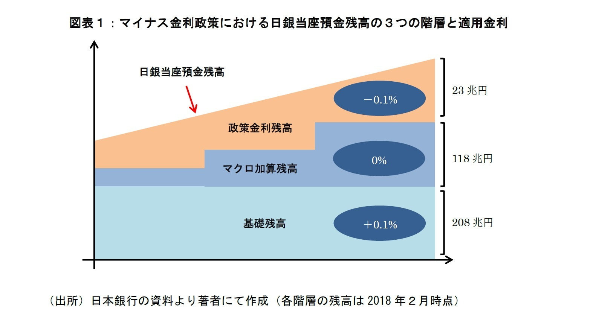
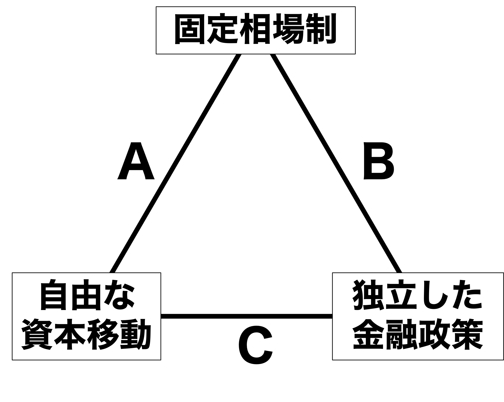

## 今日の目次

1. はじめに
1. マクロ経済政策
1. 財政政策
1. 金融政策
1. 国際金融のトリレンマ
1. まとめ

# はじめに
::: {.notes}
目標15分

:::

## 先週のRPより
TBD

## 本日の目的と到達目標
#### 目的
財政政策と金融政策という2つのマクロ経済政策を学んだ上で、「国際金融のトリレンマ」の見地から、国際収支と為替制度とマクロ経済政策の三者間関係を理論的に考察する。

::: {.fragment .fade-in}
#### 到達目標
1. マクロ経済政策とは何かを説明できる。
1. 財政政策が国内マクロ経済及び国際経済にどのような影響を与えるのかを説明できる。
1. 金融政策が国内マクロ経済及び国際経済にどのような影響を与えるのかを説明できる。
1. 国際金融のトリレンマとは何かを説明できる。

:::

## 本日の授業の位置付け

# マクロ経済政策
## 質問
第5回のスライドを見て、ケインズ主義経済学とはどのようなものかを確認してください。

## マクロ経済政策
#### macroeconomic policies
国が経済に影響を及ぼすために行う政策

::: {.incremental}
- 理論的基盤＝**ケインズ主義経済学**
   - 不景気は**有効需要**不足
      - 貨幣の裏付けのある需要
   - 政府や中央銀行が需要を増やす
- **財政政策**と**金融政策**

:::

::: {.notes}
問いかけ②

- 目的：財政政策と金融政策の内容へ導く
- 質問「高校の政経などの科目で財政政策と金融政策について習いましたか？習った場合、それぞれ何か説明できますか？」
- 進行：0.5-1分考える→挙手
:::

# 財政政策
## 財政政策 (fiscal policy)
**政府の税収と支出**を通じて経済に影響を及ぼそうとする政策

- 実施主体は**政府**
- 2つの方向性＝**財政出動**と**緊縮財政**

## Think-pair-share (-10分)
今、日本政府が減税と同時に支出を増やしました。

::: {.incremental}
1. 日本の市場に出回る貨幣の量（マネーサプライ）は増えますか、減りますか。
1. その結果、家計と企業はどのような行動を取ると思われますか

:::

## 財政出動と緊縮財政
**財政出動**…政府が財政赤字を出すこと

::: {.incremental}
- 減税や福祉拡大などで税収＜支出
- 貨幣供給量の増大→有効需要の増大
- 結果：経済成長、低失業、高インフレ

:::

::: {.fragment .fade-in}
**緊縮財政**…政府が財政黒字を出すこと

::: {.incremental}
- 増税や福祉削減などで税収＞支出
- 貨幣供給量の減少→有効需要の減少
- 結果：経済減速、高失業、低インフレ

:::
:::

::: {.notes}
質問（財政出動・緊縮財政の後）

- 目的：財政政策の話を現実と紐づけて理解する
- 質問「現在の高市政権が掲げる財政政策の方向性は財政出動と緊縮財政どちらに近いでしょうか？」
- 進行：1-2分考える→1-2人に当てる

:::

## 国際収支への影響
財政政策は**経常収支**に作用

::: {.incremental}
- 財政出動→需要の喚起
- 国外産品の購入増→経常赤字圧力
- 緊縮は逆に経常黒字圧力
- Cf.「双子の赤字」…財政赤字と経常赤字の同時発生
   - IMFコンディショナリティの緊縮要求

:::

# 金融政策
## 金融政策 (monetary policy)
中央銀行による貨幣供給量の操作を通じて経済に影響を及ぼそうとする政策

::: {.incremental}
- 実施主体は**中央銀行**
- 2つの方向性
   - **金融緩和**……貨幣供給量増大→高成長・低失業・高インフレ
   - **金融引き締め**…貨幣供給量減少→低成長・高失業・低インフレ
- 2つの方法＝**公開市場操作**と**政策金利操作**

:::

::: {.notes}
クイズ①

- 目的：中央銀行についての基礎知識を深める
- 質問「日本とアメリカの中央銀行はそれぞれなんという名前か知っていますか？」
  - （答え）日本→日本銀行、アメリカ→連邦準備制度（FRS）
- 進行：2-3人に当てる
  - アメリカのFRSはあまり知らない人が多い
  
:::

## 公開市場操作 (open market operation)
中央銀行が金融資産を売買することで貨幣供給量を操作する政策

::: {.incremental}
- 伝統的には**国債**が対象
   - 黒田日銀時代には株式や投資信託に拡大（**量的・質的金融緩和**）
- 2つの方向性
   - **買いオペレーション**…緩和志向：中銀の金融資産購入→貨幣供給量増大
   - **売りオペレーション**…引き締め志向：中銀の金融資産売却→貨幣供給量減少

:::

## 政策金利操作 (interest rate operation)
中央銀行が政策金利を誘導することで貨幣供給量を操作する政策

::: {.incremental}
- 日本銀行の例：
   - 日本銀行当座預金の利率→市中銀行の貸出姿勢→貨幣供給量
      - **日本銀行当座預金**⋯市中銀行の日銀への預金
   - **政策金利**⋯誘導目標となる市場金利で、市中銀行の貸出姿勢を測る指標
      - **無担保コールレート**⋯銀行同士の短期貸出の金利
      
:::

## クイズ

あなたは銀行の貸し出し担当者です。今、日本銀行が各銀行に付与している当座預金の利率を下げたとします。銀行の利益のためにすべきなのは以下のうちどちらですか？

1. 当座預金からお金を引き出し、貸し出しを増やす
1. 貸し出しを抑え、当座預金額を増やす

## 政策金利操作の効果
日銀当預利率を下げると…

::: {.incremental}
- 市中銀行は貸し出しに積極的に
   - 預けるよりは貸し出して利息を取る方が儲かる
- 結果、貨幣供給量の増加→有効需要の増加
   - 銀行同士の貸し借りの活発化→コールレートの下落
   - 顧客への貸し出し活発化→例えば住宅ローン金利低下

:::

## マイナス金利
{.r-stretch}

# 国際金融のトリレンマ
## 国際金融のトリレンマ
#### The Impossible Trinity
**固定相場制、自由な資本移動、独立した金融政策**の3つの目標のうち、2つしか同時に達成できないこと

::: {.fragment .fade-in}
{width=60%}

:::

::: {.notes}
トリレンマ

- マンデル＝フレミングモデルから導出
   - Cf. 収斂仮説…国際的な経済統合による政策手段の制約

例：

- 変動相場制（A）…現在の日本とアメリカ
- 資本移動規制（B）…ブレトン・ウッズ体制
- 金融政策の統合（C）…ユーロ圏（→欧州中央銀行）

:::

## 質問
今日本は金融緩和志向、アメリカは金融引き締め志向です。日米間で資本の移動は自由であるとします。

::: {.incremental}
1. 全体的にどちらの金利が高くなるでしょうか。
1. 投資するとしたらどちらが儲かるでしょうか。
1. その結果、円とドルの為替レートはどうなるでしょうか。

:::

--- 

今日米の金利差の結果円安ドル高になることがわかりました。ここで米ドルに固定相場制を導入するとします。

::: {.incremental}
1. この時政府・日銀はどのような行動を取るべきでしょうか。
1. この行動（為替介入）はいつまで続けることができるでしょうか。それはなぜでしょうか。

:::

## トリレンマのロジック
2カ国が独立した金融政策を採用＝金利が存在…

::: {.incremental}
1. **低金利国**から**高金利国**へ資本が移動
1. 資本移動に伴い為替レートが変動
   - 高金利国通貨の**増価**
   - 低金利国通貨の**減価**
1. 固定相場制のための**為替介入**→無制限には不可能
   - **売り介入**→理論上は無制限に可能
   - **買い介入**→外貨準備の範囲内に制限

:::

---

できることは…

::: {.incremental}
1. 独立した金融政策を放棄し、金利差を無くす
   - 例：ユーロ圏（A）
1. 資本移動を規制する
   - 例：ブレトン・ウッズ体制（B）
1. 固定相場制を諦める
   - 例：現在の日米（C）

:::

# まとめ
## 本日の目的と到達目標
#### 目的
財政政策と金融政策という2つのマクロ経済政策を学んだ上で、「国際金融のトリレンマ」の見地から、国際収支と為替制度とマクロ経済政策の三者間関係を理論的に考察する。

::: {.fragment .fade-in}
#### 到達目標
1. マクロ経済政策とは何かを説明できる。
1. 財政政策が国内マクロ経済及び国際経済にどのような影響を与えるのかを説明できる。
1. 金融政策が国内マクロ経済及び国際経済にどのような影響を与えるのかを説明できる。
1. 国際金融のトリレンマとは何かを説明できる。

:::

## 次回までに

#### 事後学習

 - 授業資料を見直し、目標到達をセルフチェック
 - Moodle上でのリアクションペーパー入力（木曜日まで）
